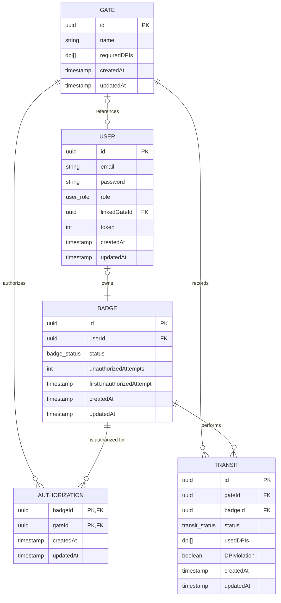

# 🔐 Backend per la Gestione degli Accessi ai Varchi 🦺

     
   

<hr />

Il seguente progetto è stato sviluppato come parte dell’esame di **Programmazione Avanzata (A.A. 2024/2025)** presso l'*
*Università Politecnica delle Marche**, all’interno del **Corso di Laurea Magistrale in Ingegneria Informatica e
dell’Automazione (LM-32)**.  
Il sistema realizzato è un **back-end per la gestione dei transiti e degli accessi autorizzati nei varchi di un cantiere
**, sviluppato in **TypeScript**, utilizzando **Node.js**, **Express**, **Sequelize**, **PostgreSQL**, **JWT** per
l’autenticazione.

L’idea alla base del progetto è quella di monitorare e controllare l’accesso di persone dotate di **badge identificativo**, in base a specifiche **autorizzazioni** e al **possesso dei Dispositivi di Protezione Individuale (DPI)** richiesti
da ciascun varco. Il sistema consente:

- la **registrazione dei transiti** con data, ora, badge e DPI utilizzati;
- il **blocco dell’accesso** in caso di assenza di autorizzazione o DPI obbligatori;
- la gestione di **log** di accessi autorizzati e tentativi non autorizzati;
- la **sospensione automatica** dell’utenza in caso di ripetuti tentativi non autorizzati (configurabile tramite
  variabili ambiente);
- l’esportazione di **report statistici** sui transiti in formato JSON, CSV e PDF.

Il progetto è stato sviluppato dagli studenti <a href="https://github.com/davideticchiarelli01">Davide Ticchiarelli</a>
e <a href="https://github.com/giamp109">Giampaolo Marino</a> per il corso di <b>Programmazione Avanzata</b> tenuto dal
Prof. Adriano Mancini.<br>

# Indice

- [Obiettivi di progetto](#obiettivi-di-progetto)
- [Progettazione](#progettazione)
    - [Architettura dei servizi](#architettura-dei-servizi)
    - [Pattern utilizzati](#pattern-utilizzati)
    - [Diagrammi UML](#diagrammi-uml)
        - [Diagramma dei casi d'uso](#diagramma-dei-casi-duso)
        - [Diagramma E-R](#diagramma-e-r)
        - [Diagrammi delle sequenze](#diagrammi-delle-sequenze)
- [API Routes](#api-routes)
- [Configurazione e uso](#configurazione-e-uso)
- [Strumenti utilizzati](#strumenti-utilizzati)
- [Autori](#autori)

# Obiettivi di progetto

L’obiettivo principale del progetto è sviluppare un sistema backend per la gestione dei transiti attraverso i varchi di
controllo di un cantiere. Per raggiungere questo obiettivo, è necessario implementare le seguenti funzionalità:

- CRUD per la gestione dei badge;
- CRUD per la gestione dei varchi;
- CRUD per la gestione delle autorizzazioni di accesso;
- Inserimento dei transiti (con relativo log contenente lo status del transito) di un utente in un gate da parte di un
  Amministratore o di un Varco:
    - Nel caso di un numero di tentativi non autorizzati superiore a 3 in un intervallo temporale di 20min è necessario
      sospendere l’utenza (inserire tali parametri come var di env).
- Restituire un eleneco di badgeId sospesi;
- Riattivare uno o più badgeId sospesi;
- Restituire uno specifico transito a un utente o ad un amministratore;
- Eliminazione e Update di un transito;
- Restituire, dato un badgeId e, opzionalmente, un intervallo temporale, il numero di accessi per ogni varco e il numero
  di tentativi di accesso con violazione;
- Generare un report in formato PDF, CSV o JSON, con possibilità di filtrare per intervallo temporale, contenente per
  ogni varco il numero di transiti autorizzati, non autorizzati e le violazioni relative all’utilizzo dei DPI richiesti.
- Generare un report in formato PDF, CSV o JSON, filtrabile per intervallo temporale, che riporti per ogni badgeId il
  numero di transiti autorizzati, non autorizzati e lo stato del badge. Gli amministratori possono ottenere report su
  tutti i badge, mentre gli utenti possono visualizzare esclusivamente il report relativo al proprio badgeId.

Infine, per garantire un corretto sistema di autenticazione e autorizzazione, è stato implementato un meccanismo di
login che consente l’accesso agli utenti in base al proprio ruolo: User, Admin o Gate.

# Progettazione

Una progettazione software efficace richiede un’organizzazione chiara e coerente delle componenti principali del
sistema. Nel nostro caso, l’architettura è stata strutturata per garantire manutenibilità, scalabilità e leggibilità del
codice. Ogni modulo è stato progettato con una responsabilità ben definita, contribuendo in modo ordinato e coeso al
funzionamento dell’intera applicazione.

Di seguito viene presentata la struttura ad albero delle principali directory del progetto:

```
SafeGate_PA/
├── img/
├── jwt_keys/
├── postman/
├── src/
│   ├── @types/
│   ├── controllers/
│   ├── dao/
│   ├── db/
│   ├── enum/
│   ├── factories/
│   ├── logger/
│   ├── middlewares/
│   ├── models/
│   ├── repositories/
│   ├── routes/
│   ├── services/
│   ├── tests/
│   ├── utils/
│   ├── app.ts
│   └── dependencies.ts
├── .dockerignore
├── .env
├── .gitignore
├── docker-compose.yml
├── Dockerfile
├── jest.config.js
├── package.json
├── package-lock.json
├── README.md
└── tsconfig.json
```

## Architettura dei servizi

## Pattern utilizzati
### Model-Controller-Service
Il pattern **Model-Controller-Service** è un pattern architetturale molto diffuso per sviluppo di aplicazioni modulari e backend che, a differenza del pattern MVC (Model-View-Controller), non prevede appunto l'implementazione di viste ma si concentra sulla gestione e sulla logica di business dell'applicativo da sviluppare. Questo pattern prevede quindi tre componenti principali:
- ***Model***: rappresenta la struttura dati dell'applicazione e si occupa dell'interazione di essa con il database. Nel caso di SafeGate, i modelli interagiscono con il sistema di storicizzazione dei dati grazie all'ausilio dell'ORM Sequelize il quale offre un insieme di funzioni che permette un dialogo intuitivo con il livello sottostante. Questa pratica consente di astrarre la logica SQL sottostante, mantenendo il codice modulare e facilmente manutenibile.
- ***Controller***: è il componente responsabile della gestione delle richieste in ingresso ed è quindi, il punto di accesso tra il client e l'applicazione; riceve la richiesta (precedentemente validata) e la inoltra successivamente ad uno specifico Service che si occuperà di elaborarla.
- ***Service***: è il componente in cui risiede la logica di business dell'applicazione. Qui vengono eseguite le operazioni più complesse e avviene l'interazione con il layer dati. Nel caso di SafeGate, il Service layer si interfaccia con le Repositories, permettendo così l'interazione indiretta con il database.

### Repository
Il **Repository** è un pattern architetturale che introduce un ulteriore strato di astrazione logica tra le tecnologie di persistenza dei dati (es. Sequelize) e la logica di business e il dominio applicativo. 

Nel progetto SafeGate **Repository** funge dunque, da strato intermedio collocato tra il **DAO** e il **Service** ed ha il compito di *astrarre e arricchire la logica di accesso ai dati*, nello specifico:
- Ogni Repository è associato a un singolo DAO.
- Espone metodi più espressivi e orientati al dominio (es. `findByBadgeGateAndDate`, `findManyByIdAndStatus`).
- Consente al Service Layer di interagire con i dati in modo pulito, senza occuparsi dei dettagli di accesso.

### DAO
Il **DAO (Data Access Object)** è un pattern strutturale che isola la logica di accesso al database dal resto dell'applicativo e fornisce un'interfaccia per le operazioni sui dati. 

Nel progetto SafeGate, il pattern DAO funge quindi da intermediario tra il **Repository** layer e i **Sequelize models**, implementando le logiche per le operazioni di CRUD (Create, Read, Update e Destroy) con l'ausilio dei metodi forniti da Sequelize. Nello specifico si osserva che:
- ogni modello Sequelize ha un DAO dedicato che espone metodi come `findByPk`, `findAll`, `create`, `update`, `destroy`, senza introdurre logica applicativa.
- Dao è uno strato riutilizzabile e permette quindi alle Repository di costruire su di esso dei metodi più ricchi e maggiormante orientati verso il dominio appicativo.
- Questo layer fornisce un accesso semplice e diretto alle entità presenti nel database.


### Dipendency Injection
La **Dependency Injection** è un principio di progettazione che prevede **l’iniezione delle dipendenze nei componenti** anziché istanziarle direttamente al loro interno. Questo approccio favorisce una maggiore modularità, testabilità e manutenibilità del codice. 

Nel contesto di SafeGate la DI viene impiegata per la costruzione di oggetti, passandogli le dipendenze necessarie nei *constructor* in modo che sia presente una dichiarazione esplicita delle dipendenze al fine di garantire manutenibilità e testabilità. 

Esempio:
```ts
export class BadgeService {
    constructor(
      private repo: BadgeRepository, 
      private userRepo: UserRepository
    ) {}
    ...business logic;
}
```
### Unit of Work
Il pattern **Unit of Work** consente di **coordinare più operazioni su entità diverse** in un’unica **transazione**, garantendo **coerenza e atomicità**.
Nel progetto:
- Consente di gestire **operazioni sequenziali su più entità** (es. aggiornamento di `Badge` seguito dalla creazione di un `Transit`) in modo sicuro e controllato tramite le **Transaction**.
- Permette di **centralizzare le operazioni di commit e rollback**, mantenendo il codice dei service più pulito e disaccoppiato dalla logica transazionale.
  
### Singleton
Il Singleton è un pattern creazionale che assicura l’esistenza di **una singola istanza di una classe** e fornisce un punto di accesso globale ad essa. Questo approccio è particolarmente utile per la gestione di risorse condivise, come connessioni al database o configurazioni globali. 

Nel progetto è stato adottato il pattern **Singleton** per garantire che alcune componenti fondamentali dell’applicazione, come la connessione al database, siano istanziate una sola volta durante l’intero ciclo di vita del server. 

### Factory
Il **Factory** è un pattern creazionale che permette di delegare un'istanzazione basata su parametri dinamici ad una specifica classe chiamata *Factory*. A differenza di un classico Factory Method che prevede un'effettiva gerarchia tra classi e sottoclassi che implementano dei metodi di creazione specifici, nel caso di SafeGate è stata definita una classe principale, come ad esempio `ErrorFactory` o `ReportFactory`, che centralizza la logica di costruzione di oggetti attraverso metodi statici. Questo pattern è stato implementato al fine di garantire modularità, leggibilità, scalabilità e manutenibilità. 

### Chain Of Responsability
Il **Chain Of Responsability (COR)** è un pattern comportamentale che consente di inserire una richiesta all'interno di una *catena di handlers* che possono o meno effettuare delle operazioni su di essa prima di passarla al gestore successivo. 

Nel contesto progettuale di SafeGate, è stato applicato il **Chain of Responsibility** sfruttando il sistema di **middleware di Express.js**. Questo ha permesso di organizzare il flusso di elaborazione delle richieste HTTP in maniera modulare, estensibile e facilmente manutenibile. Ogni middleware rappresenta un nodo nella catena che si occupa di una responsabilità specifica e può decidere se continuare il flusso di elaborazione o bloccarlo restituendo una risposta.
In SafeGate, i middleware sono stati utilizzati per implementare logiche fondamentali come:
- **Middleware di autenticazione (`authMiddleware`)**: Verifica che l’utente sia autenticato tramite un token JWT. Se il token è assente o invalido, la richiesta viene interrotta e restituito un errore `401 Unauthorized`.

- **Middleware di autorizzazione (`adminMiddleware`, `userOrAdminMiddleware`, `gateOrAdminMiddleware`)**: dopo l’autenticazione, questi middleware controllano che l’utente abbia i permessi per accedere alla risorsa richiesta, in base al ruolo (admin, utente standard o dispositivo gate).

- **Middleware di validazione (`express-validator`)**: Controlla che i dati forniti nella richiesta (body, params, query) siano corretti e coerenti con le specifiche previste. In caso contrario, la catena si interrompe e viene restituito un errore dettagliato.

- **Middleware di gestione degli errori**: Intercetta e gestisce centralmente le eccezioni e gli errori sollevati nella catena, restituendo risposte coerenti e formattate tramite la `ErrorFactory`.

## Diagrammi UML

### Diagramma dei casi d'uso

Il diagramma dei casi d’uso fornisce una visione d’insieme delle funzionalità offerte dal sistema e delle interazioni
che ciascun attore può avere con esso. In particolare, sono stati individuati quattro attori principali:

- Unauthenticated User;
- User std (utente standard con badge);
- Admin (amministratore di sistema);
- Gate.

Ciascun attore ha accesso a specifici casi d’uso, corrispondenti alle operazioni consentite all’interno del sistema,
come l’inserimento di transiti o la generazione di report. Il diagramma riportato di seguito rappresenta graficamente
tali interazioni.


### Diagramma E-R

L’applicazione utilizza PostgreSQL come sistema di gestione di basi di dati relazionali (RDBMS), scelto per la sua affidabilità, le
ottime performance e la capacità di gestire strutture dati complesse, supportare transazioni e facilitare l’evoluzione
del modello dati nel tempo. Queste caratteristiche lo rendono particolarmente adatto per un'applicazione moderna e
scalabile.

Alla base della progettazione è stato sviluppato un diagramma E-R (Entity-Relationship), che rappresenta in modo
concettuale le principali entità del sistema e le relazioni tra di esse. Questo schema ha guidato la definizione delle
tabelle del database, dei vincoli e delle connessioni logiche necessarie a supportare le funzionalità previste. In
particolare, è stato utilizzato per modellare le componenti fondamentali del sistema di gestione degli accessi ai
varchi, tra cui: User, Badge, Gate, Authorization e Transit.



### Diagrammi delle sequenze

# API Routes

| **HTTP**   | **Endpoint**                       | **Descrizione**                                            | **JWT** | **Ruolo**               |
|------------|------------------------------------|------------------------------------------------------------|---------|-------------------------|
| **POST**   | `/login`                           | Autenticazione dell'utente tramite email e password.       | ❌       | Tutti                   |
| **GET**    | `/transits`                        | Recupera tutti i transiti registrati.                      | ✅       | Admin                   |
| **GET**    | `/transits/:id`                    | Recupera uno specifico transito.                           | ✅       | Admin, User (solo suoi) |
| **POST**   | `/transits`                        | Crea un transito (esito positivo o negativo).              | ✅       | Admin, Gate             |
| **PUT**    | `/transits/:id`                    | Modifica un transito esistente.                            | ✅       | Admin                   |
| **DELETE** | `/transits/:id`                    | Elimina un transito esistente.                             | ✅       | Admin                   |
| **GET**    | `/transits_stats/:badgeId`         | Recupera statistiche dei transiti di un badge.             | ✅       | Admin, User (solo suoi) |
| **GET**    | `/gate_report`                     | Esporta il numero di transiti in un gate (JSON, PDF, CSV). | ✅       | Admin                   |
| **GET**    | `/badge_report`                    | Esporta i transiti di un badge (JSON, PDF, CSV).           | ✅       | Admin, User (solo suoi) |
| **GET**    | `/authorizations`                  | Recupera tutte le autorizzazioni.                          | ✅       | Admin                   |
| **GET**    | `/authorizations/:badgeId/:gateId` | Recupera un'autorizzazione specifica.                      | ✅       | Admin                   |
| **POST**   | `/authorizations`                  | Crea un'autorizzazione tra gate e badge.                   | ✅       | Admin                   |
| **DELETE** | `/authorizations/:badgeId/:gateId` | Elimina un'autorizzazione esistente.                       | ✅       | Admin                   |
| **GET**    | `/gates`                           | Recupera tutti i gate registrati.                          | ✅       | Admin                   |
| **GET**    | `/gates/:id`                       | Recupera un gate specifico.                                | ✅       | Admin                   |
| **POST**   | `/gates`                           | Crea un nuovo gate.                                        | ✅       | Admin                   |
| **PUT**    | `/gates/:id`                       | Modifica un gate esistente.                                | ✅       | Admin                   |
| **DELETE** | `/gates/:id`                       | Elimina un gate esistente.                                 | ✅       | Admin                   |
| **GET**    | `/badges`                          | Recupera tutti i badge.                                    | ✅       | Admin                   |
| **GET**    | `/badges/:id`                      | Recupera un badge specifico.                               | ✅       | Admin                   |
| **POST**   | `/badges`                          | Crea un nuovo badge.                                       | ✅       | Admin                   |
| **PUT**    | `/badges/:id`                      | Modifica un badge esistente.                               | ✅       | Admin                   |
| **DELETE** | `/badges/:id`                      | Elimina un badge esistente.                                | ✅       | Admin                   |
| **GET**    | `/badges_suspended`                | Recupera tutti i badge sospesi.                            | ✅       | Admin                   |
| **GET**    | `/reactivate_badges`               | Riattiva uno o più badge.                                  | ✅       | Admin                   |

# Configurazione e uso
Di seguito sono elencati i passaggi necessari per configurare correttamente l'applicazione SafeGate e renderla operativa in un container Docker.
- Prima di tutto bisogna ssicurarsi di avere *Docker* e *Docker Compose* installati. Nel caso in cui non lo fossero è necessario procedere all'installazione al fine di poter permettere la creazione di un container nel quale verrà eseguito SafeGate.

- In seguito è possibile clonare la repository GitHub del progetto; lanciare quindi il seguente comando: 

  ```
  git clone https://github.com/davideticchiarelli01/SafeGate_PA
  ```

- All'interno della directory del progetto bisogna configurare il file `.env` al fine di definire le variabili di ambiente necessarie al corretto funzionamento dell'applicazione. Di seguito si può osservare un esempio di struttura del file:

    ```
    DB_HOST=
    DB_PORT=
    DB_USER=
    DB_PASS=
    DB_NAME=
    DB_DIALECT=

    APP_PORT=
    ```
  Bisogna compilare tuti i campi con i valori appropriati per il proprio ambiente di sviluppo.

- A questo punto è possibile avviare l'applicazione su un container Docker eseguendo il comando dalla directory di progetto:
  ```
  docker-compose up --build
  ```

Infine se la build ha avuto successo, SafeGate sarà raggiungibile all'indirizzo `http://localhost:3000/`.

Per testare l'applicazione è possibile utilizzare il client Postman sfruttando i file a disposizione:
- *Collection*: `Collection_SafeGate_PA_Ticchiarelli_Marino_2025`
- *Environment*: `Environment_SafeGate_PA_Ticchiarelli_Marino_2025`

# Strumenti utilizzati

- **Node.js**: Ambiente di esecuzione JavaScript lato server, utilizzato per costruire l’intero backend
  dell'applicazione.
- **TypeScript**: Superset di JavaScript che introduce il tipaggio statico, migliorando la manutenibilità e la sicurezza
  del codice.
- **Express JS**: Framework minimalista per Node.js, usato per la gestione delle rotte, middleware e logica HTTP.
- **PostgreSQL**: Database relazionale open-source, scelto per l'affidabilità, la scalabilità e il supporto ai tipi
  complessi (es. enum, array).
- **Sequelize**: ORM (Object Relational Mapper) per Node.js, impiegato per gestire le operazioni sul database in modo
  astratto e tipizzato.
- **JWT (JSON Web Tokens)**: Tecnologia per la gestione dell'autenticazione e dell'autorizzazione tramite token firmati
  e sicuri.
- **Jest**: Framework di testing per JavaScript/TypeScript, utilizzato per testare la logica dei middleware, servizi e
  controller.
- **Docker**: Strumento per la creazione di ambienti isolati e portabili tramite container, semplificando il deployment.
- **docker-compose**: Strumento per la gestione di più container Docker, utile per orchestrare servizi come database e
  backend in fase di sviluppo.
- **Postman**: Strumento per il test delle API, usato per verificare il corretto funzionamento delle rotte del backend.
- **WebStorm** e **VS Code**: Editor e IDE utilizzati per lo sviluppo del codice.
- **DBeaver**: Interfaccia grafica per l’esplorazione e la gestione del database PostgreSQL durante lo sviluppo e il
  debugging.

# Autori

- **Davide Ticchiarelli**  
  Matricola: S1121687

- **Giampaolo Marino**  
  Matricola: S1121678
