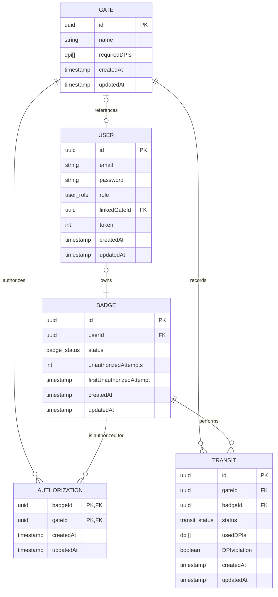

# 🔐 Backend per la Gestione degli Accessi ai Varchi 🦺

     
   

Il seguente progetto è stato sviluppato come parte dell’esame di **Programmazione Avanzata (A.A. 2024/2025)** presso l'**Università Politecnica delle Marche**, all’interno del **Corso di Laurea Magistrale in Ingegneria Informatica e dell’Automazione (LM-32)**.  
Il sistema realizzato è un **back-end per la gestione dei transiti e degli accessi autorizzati nei varchi di un cantiere**, sviluppato in **TypeScript**, utilizzando **Node.js**, **Express**, **Sequelize**, **PostgreSQL**, **JWT** per l’autenticazione.

L’idea alla base del progetto è quella di monitorare e controllare l’accesso di persone dotate di **badge identificativo**, in base a specifiche **autorizzazioni** e al **possesso dei Dispositivi di Protezione Individuale (DPI)** richiesti da ciascun varco. Il sistema consente:

- la **registrazione dei transiti** con data, ora, badge e DPI utilizzati;
- il **blocco dell’accesso** in caso di assenza di autorizzazione o DPI obbligatori;
- la gestione di **log** di accessi autorizzati e tentativi non autorizzati;
- la **sospensione automatica** dell’utenza in caso di ripetuti tentativi non autorizzati (configurabile tramite variabili ambiente);
- l’esportazione di **report statistici** sui transiti in formato JSON, CSV e PDF.

Il progetto è stato sviluppato dagli studenti <a href="https://github.com/davideticchiarelli01">Davide Ticchiarelli</a> e <a href="https://github.com/giamp109">Giampaolo Marino</a> per il corso di <b>Programmazione Avanzata</b> tenuto dal Prof. Adriano Mancini. 

# Indice

- [Obiettivi di progetto](#obiettivi-di-progetto)
- [Progettazione](#progettazione)
  - [Architettura dei servizi](#architettura-dei-servizi)
  - [Pattern utilizzati](#pattern-utilizzati)
  - [Diagrammi UML](#diagrammi-uml)
    - [Diagramma dei casi d'uso](#diagramma-dei-casi-duso)
    - [Diagramma E-R](#diagramma-e-r)
    - [Diagrammi delle sequenze](#diagrammi-delle-sequenze)
- [API Routes](#api-routes)
- [Configurazione e uso](#configurazione-e-uso)
- [Strumenti utilizzati](#strumenti-utilizzati)
- [Autori](#autori)

# Obiettivi di progetto

# Progettazione

## Architettura dei servizi

## Pattern utilizzati

## Diagrammi UML

### Diagramma dei casi d'uso

### Diagramma E-R
L’applicazione utilizza PostgreSQL come sistema di gestione di basi di dati relazionali (RDBMS), scelto per la sua affidabilità, le ottime performance e la capacità di gestire strutture dati complesse, supportare transazioni e facilitare l’evoluzione del modello dati nel tempo. Queste caratteristiche lo rendono particolarmente adatto per un'applicazione moderna e scalabile.

Alla base della progettazione è stato sviluppato un diagramma E-R (Entity-Relationship), che rappresenta in modo concettuale le principali entità del sistema e le relazioni tra di esse. Questo schema ha guidato la definizione delle tabelle del database, dei vincoli e delle connessioni logiche necessarie a supportare le funzionalità previste. In particolare, è stato utilizzato per modellare le componenti fondamentali del sistema di gestione degli accessi ai varchi, tra cui: User, Badge, Gate, Authorization e Transit.

### Diagrammi delle sequenze
# API Routes
# Configurazione e uso
# Strumenti utilizzati
# Autori
