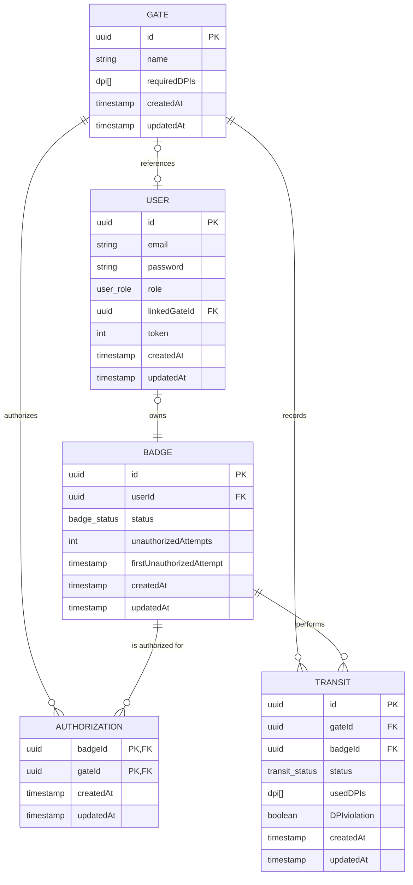

# 🔐 Backend per la Gestione degli Accessi ai Varchi 🦺

     
   

<hr />

Il seguente progetto è stato sviluppato come parte dell’esame di **Programmazione Avanzata (A.A. 2024/2025)** presso l'**Università Politecnica delle Marche**, all’interno del **Corso di Laurea Magistrale in Ingegneria Informatica e dell’Automazione (LM-32)**.  
Il sistema realizzato è un **back-end per la gestione dei transiti e degli accessi autorizzati nei varchi di un cantiere**, sviluppato in **TypeScript**, utilizzando **Node.js**, **Express**, **Sequelize**, **PostgreSQL**, **JWT** per l’autenticazione.

L’idea alla base del progetto è quella di monitorare e controllare l’accesso di persone dotate di **badge identificativo**, in base a specifiche **autorizzazioni** e al **possesso dei Dispositivi di Protezione Individuale (DPI)** richiesti da ciascun varco. Il sistema consente:

- la **registrazione dei transiti** con data, ora, badge e DPI utilizzati;
- il **blocco dell’accesso** in caso di assenza di autorizzazione o DPI obbligatori;
- la gestione di **log** di accessi autorizzati e tentativi non autorizzati;
- la **sospensione automatica** dell’utenza in caso di ripetuti tentativi non autorizzati (configurabile tramite variabili ambiente);
- l’esportazione di **report statistici** sui transiti in formato JSON, CSV e PDF.

Il progetto è stato sviluppato dagli studenti <a href="https://github.com/davideticchiarelli01">Davide Ticchiarelli</a> e <a href="https://github.com/giamp109">Giampaolo Marino</a> per il corso di <b>Programmazione Avanzata</b> tenuto dal Prof. Adriano Mancini.<br>

# Indice

- [Obiettivi di progetto](#obiettivi-di-progetto)
- [Progettazione](#progettazione)
  - [Architettura dei servizi](#architettura-dei-servizi)
  - [Pattern utilizzati](#pattern-utilizzati)
  - [Diagrammi UML](#diagrammi-uml)
    - [Diagramma dei casi d'uso](#diagramma-dei-casi-duso)
    - [Diagramma E-R](#diagramma-e-r)
    - [Diagrammi delle sequenze](#diagrammi-delle-sequenze)
- [API Routes](#api-routes)
- [Configurazione e uso](#configurazione-e-uso)
- [Strumenti utilizzati](#strumenti-utilizzati)
- [Autori](#autori)

# Obiettivi di progetto
L’obiettivo principale del progetto è sviluppare un sistema backend per la gestione dei transiti attraverso i varchi di controllo di un cantiere. Per raggiungere questo obiettivo, è necessario implementare le seguenti funzionalità:
- CRUD per la gestione dei badge;
- CRUD per la gestione dei varchi;
- CRUD per la gestione delle autorizzazioni di accesso;
- Inserimento dei transiti (con relativo log contenente lo status del transito) di un utente in un gate da parte di un Amministratore o di un Varco:
  - Nel caso di un numero di tentativi non autorizzati superiore a 3 in un intervallo temporale di 20min è necessario sospendere l’utenza (inserire tali parametri come var di env).
- Restituire un eleneco di badgeId sospesi;
- Riattivare uno o più badgeId sospesi;
- Restituire uno specifico transito a un utente o ad un amministratore;
- Eliminazione e Update di un transito;
- Restituire, dato un badgeId e, opzionalmente, un intervallo temporale, il numero di accessi per ogni varco e il numero di tentativi di accesso con violazione;
- Generare un report in formato PDF, CSV o JSON, con possibilità di filtrare per intervallo temporale, contenente per ogni varco il numero di transiti autorizzati, non autorizzati e le violazioni relative all’utilizzo dei DPI richiesti.
- Generare un report in formato PDF, CSV o JSON, filtrabile per intervallo temporale, che riporti per ogni badgeId il numero di transiti autorizzati, non autorizzati e lo stato del badge. Gli amministratori possono ottenere report su tutti i badge, mentre gli utenti possono visualizzare esclusivamente il report relativo al proprio badgeId.
  
Infine, per garantire un corretto sistema di autenticazione e autorizzazione, è stato implementato un meccanismo di login che consente l’accesso agli utenti in base al proprio ruolo: User, Admin o Gate.

# Progettazione
Una progettazione software efficace richiede un’organizzazione chiara e coerente delle componenti principali del sistema. Nel nostro caso, l’architettura è stata strutturata per garantire manutenibilità, scalabilità e leggibilità del codice. Ogni modulo è stato progettato con una responsabilità ben definita, contribuendo in modo ordinato e coeso al funzionamento dell’intera applicazione.

Di seguito viene presentata la struttura ad albero delle principali directory del progetto:
```
SafeGate_PA/
├── jwt_keys/
├── postman/
├── src/
│   ├── @types/
│   ├── controllers/
│   ├── dao/
│   ├── db/
│   ├── enum/
│   ├── factories/
│   ├── logger/
│   ├── middlewares/
│   ├── models/
│   ├── repositories/
│   ├── routes/
│   ├── services/
│   ├── tests/
│   ├── utils/
│   ├── app.ts
│   └── dependencies.ts
├── .dockerignore
├── .env
├── .gitignore
├── docker-compose.yml
├── Dockerfile
├── jest.config.js
├── package.json
├── package-lock.json
├── README.md
└── tsconfig.json
```

## Architettura dei servizi

## Pattern utilizzati

## Diagrammi UML

### Diagramma dei casi d'uso
Il diagramma dei casi d’uso fornisce una visione d’insieme delle funzionalità offerte dal sistema e delle interazioni che ciascun attore può avere con esso. In particolare, sono stati individuati quattro attori principali:
- Unauthenticated User;
- User std (utente standard con badge);
- Admin (amministratore di sistema);
- Gate.
  
Ciascun attore ha accesso a specifici casi d’uso, corrispondenti alle operazioni consentite all’interno del sistema, come l’inserimento di transiti o la generazione di report. Il diagramma riportato di seguito rappresenta graficamente tali interazioni.


### Diagramma E-R
L’applicazion
e utilizza PostgreSQL come sistema di gestione di basi di dati relazionali (RDBMS), scelto per la sua affidabilità, le ottime performance e la capacità di gestire strutture dati complesse, supportare transazioni e facilitare l’evoluzione del modello dati nel tempo. Queste caratteristiche lo rendono particolarmente adatto per un'applicazione moderna e scalabile.

Alla base della progettazione è stato sviluppato un diagramma E-R (Entity-Relationship), che rappresenta in modo concettuale le principali entità del sistema e le relazioni tra di esse. Questo schema ha guidato la definizione delle tabelle del database, dei vincoli e delle connessioni logiche necessarie a supportare le funzionalità previste. In particolare, è stato utilizzato per modellare le componenti fondamentali del sistema di gestione degli accessi ai varchi, tra cui: User, Badge, Gate, Authorization e Transit.




### Diagrammi delle sequenze
# API Routes

| **HTTP**       | **Endpoint**                                      | **Descrizione**                                                                              | **JWT** | **Ruolo**               |
|----------------|---------------------------------------------------|----------------------------------------------------------------------------------------------|--------|--------------------------|
| **POST**       | `/login`                                          | Autenticazione dell'utente tramite email e password.                                         | ❌      | Tutti                   |
| **GET**        | `/transits`                                       | Recupera tutti i transiti registrati.                                                        | ✅      | Admin                   |
| **GET**        | `/transits/:id`                                   | Recupera uno specifico transito.                                                             | ✅      | Admin, User (solo suoi) |
| **POST**       | `/transits`                                       | Crea un transito (esito positivo o negativo).                                                | ✅      | Admin, Gate             |
| **PUT**        | `/transits/:id`                                   | Modifica un transito esistente.                                                              | ✅      | Admin                   |
| **DELETE**     | `/transits/:id`                                   | Elimina un transito esistente.                                                               | ✅      | Admin                   |
| **GET**        | `/transits_stats/:badgeId`                        | Recupera statistiche dei transiti di un badge.                                               | ✅      | Admin, User (solo suoi) |
| **GET**        | `/gate_report`                                    | Esporta il numero di transiti in un gate (JSON, PDF, CSV).                                   | ✅      | Admin                   |
| **GET**        | `/badge_report`                                   | Esporta i transiti di un badge (JSON, PDF, CSV).                                             | ✅      | Admin, User (solo suoi) |
| **GET**        | `/authorizations`                                 | Recupera tutte le autorizzazioni.                                                            | ✅      | Admin                   |
| **GET**        | `/authorizations/:badgeId/:gateId`                | Recupera un'autorizzazione specifica.                                                        | ✅      | Admin                   |
| **POST**       | `/authorizations`                                 | Crea un'autorizzazione tra gate e badge.                                                     | ✅      | Admin                   |
| **DELETE**     | `/authorizations/:badgeId/:gateId`                | Elimina un'autorizzazione esistente.                                                         | ✅      | Admin                   |
| **GET**        | `/gates`                                          | Recupera tutti i gate registrati.                                                            | ✅      | Admin                   |
| **GET**        | `/gates/:id`                                      | Recupera un gate specifico.                                                                  | ✅      | Admin                   |
| **POST**       | `/gates`                                          | Crea un nuovo gate.                                                                          | ✅      | Admin                   |
| **PUT**        | `/gates/:id`                                      | Modifica un gate esistente.                                                                  | ✅      | Admin                   |
| **DELETE**     | `/gates/:id`                                      | Elimina un gate esistente.                                                                   | ✅      | Admin                   |
| **GET**        | `/badges`                                         | Recupera tutti i badge.                                                                      | ✅      | Admin                   |
| **GET**        | `/badges/:id`                                     | Recupera un badge specifico.                                                                 | ✅      | Admin                   |
| **POST**       | `/badges`                                         | Crea un nuovo badge.                                                                         | ✅      | Admin                   |
| **PUT**        | `/badges/:id`                                     | Modifica un badge esistente.                                                                 | ✅      | Admin                   |
| **DELETE**     | `/badges/:id`                                     | Elimina un badge esistente.                                                                  | ✅      | Admin                   |
| **GET**        | `/badges_suspended`                               | Recupera tutti i badge sospesi.                                                              | ✅      | Admin                   |
| **GET**        | `/reactivate_badges`                              | Riattiva uno o più badge.                                                                    | ✅      | Admin                   |


# Configurazione e uso
# Strumenti utilizzati
- **Node.js**: Ambiente di esecuzione JavaScript lato server, utilizzato per costruire l’intero backend dell'applicazione.
- **TypeScript**: Superset di JavaScript che introduce il tipaggio statico, migliorando la manutenibilità e la sicurezza del codice.
- **Express JS**: Framework minimalista per Node.js, usato per la gestione delle rotte, middleware e logica HTTP.
- **PostgreSQL**: Database relazionale open-source, scelto per l'affidabilità, la scalabilità e il supporto ai tipi complessi (es. enum, array).
- **Sequelize**: ORM (Object Relational Mapper) per Node.js, impiegato per gestire le operazioni sul database in modo astratto e tipizzato.
- **JWT (JSON Web Tokens)**: Tecnologia per la gestione dell'autenticazione e dell'autorizzazione tramite token firmati e sicuri.
- **Jest**: Framework di testing per JavaScript/TypeScript, utilizzato per testare la logica dei middleware, servizi e controller.
- **Docker**: Strumento per la creazione di ambienti isolati e portabili tramite container, semplificando il deployment.
- **docker-compose**: Strumento per la gestione di più container Docker, utile per orchestrare servizi come database e backend in fase di sviluppo.
- **Postman**: Strumento per il test delle API, usato per verificare il corretto funzionamento delle rotte del backend.
- **WebStorm** e **VS Code**: Editor e IDE utilizzati per lo sviluppo del codice.
- **DBeaver**: Interfaccia grafica per l’esplorazione e la gestione del database PostgreSQL durante lo sviluppo e il debugging.

# Autori
- **Davide Ticchiarelli**  
  Matricola: S1121687

- **Giampaolo Marino**  
  Matricola: S1121678
