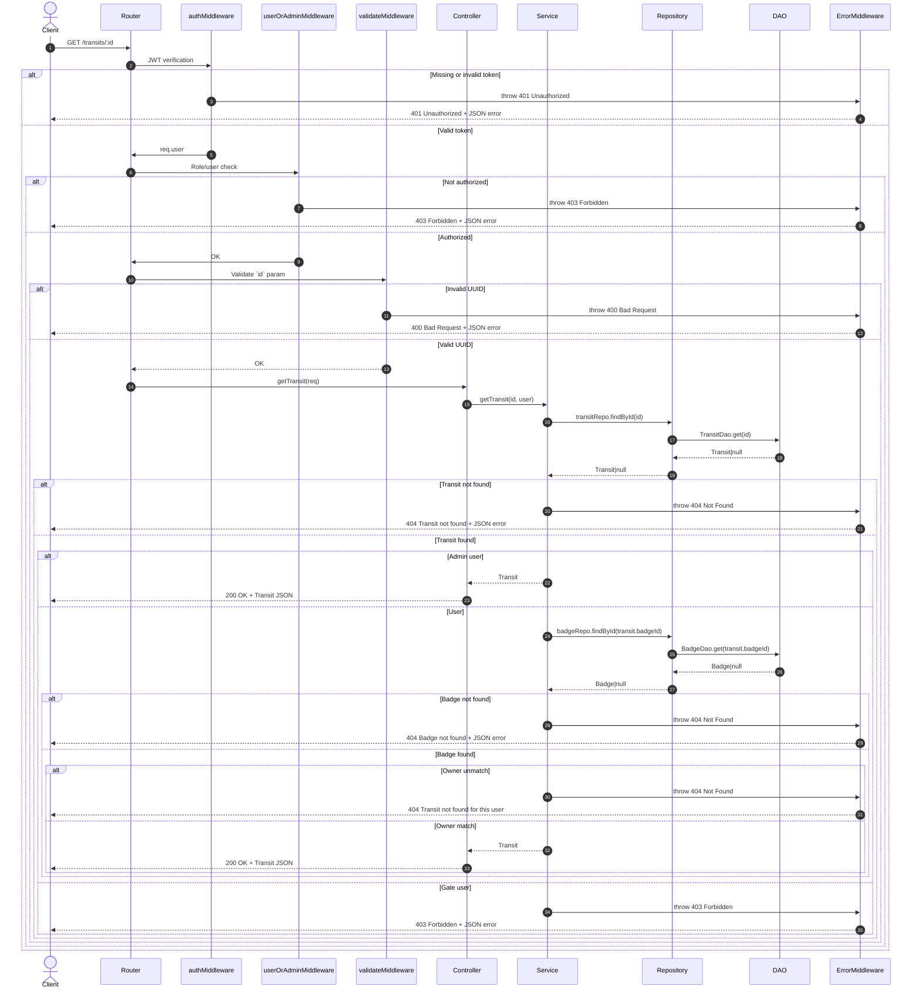

# 🔐 Backend per la Gestione degli Accessi ai Varchi 🦺

     
   

<hr />

Il seguente progetto è stato sviluppato come parte dell’esame di **Programmazione Avanzata (A.A. 2024/2025)** presso l'**Università Politecnica delle Marche**, all’interno del **Corso di Laurea Magistrale in Ingegneria Informatica e
dell’Automazione (LM-32)**.  
Il sistema realizzato è un **back-end per la gestione dei transiti e degli accessi autorizzati nei varchi di un cantiere**, sviluppato in **TypeScript**, utilizzando **Node.js**, **Express**, **Sequelize**, **PostgreSQL**, **JWT** per
l’autenticazione.

L’idea alla base del progetto è quella di monitorare e controllare l’accesso di persone dotate di **badge identificativo**, in base a specifiche **autorizzazioni** e al **possesso dei Dispositivi di Protezione Individuale (DPI)** richiesti
da ciascun varco. Il sistema consente:

- la **registrazione dei transiti** con data, ora, badge e DPI utilizzati;
- il **blocco dell’accesso** in caso di assenza di autorizzazione o DPI obbligatori;
- la gestione di **log** di accessi autorizzati e tentativi non autorizzati;
- la **sospensione automatica** dell’utenza in caso di ripetuti tentativi non autorizzati (configurabile tramite
  variabili ambiente);
- l’esportazione di **report statistici** sui transiti in formato JSON, CSV e PDF.

Il progetto è stato sviluppato dagli studenti <a href="https://github.com/davideticchiarelli01">Davide Ticchiarelli</a>
e <a href="https://github.com/giamp109">Giampaolo Marino</a> per il corso di <b>Programmazione Avanzata</b> tenuto dal
Prof. Adriano Mancini.<br>

# Indice

- [Obiettivi di progetto](#obiettivi-di-progetto)
- [Progettazione](#progettazione)
    - [Struttura del progetto](#struttura-del-progetto)
    - [Pattern utilizzati](#pattern-utilizzati)
    - [Diagrammi UML](#diagrammi-uml)
        - [Diagramma dei casi d'uso](#diagramma-dei-casi-duso)
        - [Diagramma E-R](#diagramma-e-r)
        - [Diagrammi delle sequenze](#diagrammi-delle-sequenze)
- [Rotte API](#rotte-api)
- [Configurazione e uso](#configurazione-e-uso)
- [Strumenti utilizzati](#strumenti-utilizzati)
- [Divisione dei Compiti](#divisione-dei-compiti)
- [Autori](#autori)

# Progettazione
## Obiettivi di progetto

L’obiettivo principale del progetto è sviluppare un sistema backend per la gestione dei transiti attraverso i varchi di
controllo di un cantiere. Per raggiungere questo obiettivo, è necessario implementare le seguenti funzionalità:

- CRUD per la gestione dei badge;
- CRUD per la gestione dei varchi;
- CRUD per la gestione delle autorizzazioni di accesso;
- Inserimento dei transiti (con relativo log contenente lo status del transito) di un utente in un gate da parte di un
  Amministratore o di un Varco:
    - Nel caso di un numero di tentativi non autorizzati superiore a 3 in un intervallo temporale di 20min è necessario
      sospendere l’utenza (inserire tali parametri come var di env).
- Restituire un elenco di badgeId sospesi;
- Riattivare uno o più badgeId sospesi;
- Restituire uno specifico transito a un utente o ad un amministratore;
- Eliminazione e Update di un transito;
- Restituire, dato un badgeId e, opzionalmente, un intervallo temporale, il numero di accessi per ogni varco e il numero
  di tentativi di accesso con violazione;
- Generare un report in formato PDF, CSV o JSON, con possibilità di filtrare per intervallo temporale, contenente per
  ogni varco il numero di transiti autorizzati, non autorizzati e le violazioni relative all’utilizzo dei DPI richiesti.
- Generare un report in formato PDF, CSV o JSON, filtrabile per intervallo temporale, che riporti per ogni badgeId il
  numero di transiti autorizzati, non autorizzati e lo stato del badge. Gli amministratori possono ottenere report su
  tutti i badge, mentre gli utenti possono visualizzare esclusivamente il report relativo al proprio badgeId.

Infine, per garantire un corretto sistema di autenticazione e autorizzazione, è stato implementato un meccanismo di
login che consente l’accesso agli utenti in base al proprio ruolo: User, Admin o Gate.

## Struttura del progetto
Il progetto SafeGate è organizzato secondo una struttura modulare e scalabile, che segue le best practice per applicazioni express.js sviluppate in TypeScript. Ogni cartella è responsabile di una specifica area funzionale del sistema, favorendo la separazione delle responsabilità, la manutenibilità del codice e la facilità nei test.

Di seguito è riportata la struttura principale del progetto:
```
SafeGate_PA/
├── img/
├── jwt_keys/
├── postman/
├── src/
│   ├── @types/
│   ├── controllers/
│   ├── dao/
│   ├── db/
│   ├── enum/
│   ├── factories/
│   ├── logger/
│   ├── middlewares/
│   ├── models/
│   ├── repositories/
│   ├── routes/
│   ├── services/
│   ├── tests/
│   ├── utils/
│   ├── app.ts
│   └── dependencies.ts
├── .dockerignore
├── .env
├── .gitignore
├── docker-compose.yml
├── Dockerfile
├── jest.config.js
├── package.json
├── package-lock.json
├── README.md
└── tsconfig.json
```

## Pattern utilizzati
### Model-Controller-Service
Il pattern **Model-Controller-Service** è un pattern architetturale molto diffuso per sviluppo di aplicazioni modulari e backend che, a differenza del pattern MVC (Model-View-Controller), non prevede appunto l'implementazione di viste ma si concentra sulla gestione e sulla logica di business dell'applicativo da sviluppare. Questo pattern prevede quindi tre componenti principali:
- ***Model***: rappresenta la struttura dati dell'applicazione e si occupa dell'interazione di essa con il database. Nel caso di SafeGate, i modelli interagiscono con il sistema di storicizzazione dei dati grazie all'ausilio dell'ORM Sequelize il quale offre un insieme di funzioni che permette un dialogo intuitivo con il livello sottostante. Questa pratica consente di astrarre la logica SQL sottostante, mantenendo il codice modulare e facilmente manutenibile.
- ***Controller***: è il componente responsabile della gestione delle richieste in ingresso ed è quindi, il punto di accesso tra il client e l'applicazione; riceve la richiesta (precedentemente validata) e inoltra i dati necessari ad uno specifico Service.
- ***Service***: è il componente in cui risiede la logica di business dell'applicazione. Qui vengono eseguite le operazioni più complesse e avviene l'interazione con il layer dati. Nel caso di SafeGate, il Service layer si interfaccia con le Repositories, permettendo così l'interazione indiretta con il database.

### Repository
Il **Repository** è un pattern architetturale che introduce un ulteriore strato di astrazione logica tra le tecnologie di persistenza dei dati (es. Sequelize) e la logica di business e il dominio applicativo. 

Nel progetto SafeGate **Repository** funge da strato intermedio collocato tra il **DAO** e il **Service** ed ha il compito di *astrarre e arricchire la logica di accesso ai dati*, nello specifico:
- Ogni Repository è associato a un singolo DAO.
- Espone metodi più espressivi e orientati al dominio (es. `findByBadgeGateAndDate`, `findManyByIdAndStatus`).
- Consente al Service Layer di interagire con i dati in modo pulito, senza occuparsi dei dettagli di accesso.

### DAO
Il **DAO (Data Access Object)** è un pattern strutturale che isola la logica di accesso al database dal resto dell'applicativo e fornisce un'interfaccia per le operazioni sui dati. 

Nel progetto SafeGate, il pattern DAO funge quindi da intermediario tra il **Repository** layer e i **Sequelize models**, implementando le logiche per le operazioni CRUD (Create, Read, Update e Destroy) di base, sfruttando i metodi forniti da Sequelize. Nello specifico si osserva che:
- ogni modello Sequelize ha un DAO dedicato che espone metodi come `findByPk`, `findAll`, `create`, `update`, `destroy`, senza introdurre logica applicativa.
- Dao è uno strato riutilizzabile e permette, quindi, alle Repository di costruire su di esso dei metodi più ricchi e maggiormente orientati verso il dominio applicativo.
- Questo layer fornisce un accesso semplice e diretto alle entità presenti nel database.


### Dipendency Injection
La **Dependency Injection** è un principio di progettazione che prevede **l’iniezione delle dipendenze nei componenti** anziché istanziarle direttamente al loro interno. Questo approccio favorisce una maggiore modularità, testabilità e manutenibilità del codice. 

Nel contesto di SafeGate la DI viene impiegata per la costruzione di oggetti, passandogli le dipendenze necessarie nei *constructor* in modo che sia presente una dichiarazione esplicita delle dipendenze al fine di garantire manutenibilità e testabilità. 

Esempio:
```ts
export class BadgeService {
    constructor(
      private repo: BadgeRepository, 
      private userRepo: UserRepository
    ) {}
    ...business logic;
}
```
### Unit of Work
Il pattern **Unit of Work** consente di **coordinare più operazioni su entità diverse** in un’unica **transazione**, garantendo **coerenza e atomicità**.
Nel progetto:
- Consente di gestire **operazioni sequenziali su più entità** (es. aggiornamento di `Badge` seguito dalla creazione di un `Transit`) in modo sicuro e controllato tramite le **Transaction**.
- Permette di **centralizzare le operazioni di commit e rollback**, mantenendo il codice dei service più pulito e disaccoppiato dalla logica transazionale.

Il motivo principale che ha spinto all'adozione di questo pattern è la necessità di gestire le transazioni a livello di service senza esporre direttamente Sequelize, evitando così di mischiare la logica di più DAO all'interno di un singolo repository.

### Singleton
Il **Singleton** è un pattern creazionale che assicura l’esistenza di **una singola istanza di una classe** e fornisce un punto di accesso globale ad essa. Questo approccio è particolarmente utile per la gestione di risorse condivise, come connessioni al database o configurazioni globali. 

Nel progetto è stato adottato il pattern **Singleton** per garantire che alcune componenti fondamentali dell’applicazione, come la connessione al database, siano istanziate una sola volta durante l’intero ciclo di vita del server. 

### Factory
Il Factory è un pattern creazionale che consente di centralizzare la creazione degli oggetti, separando la logica costruttiva dal resto dell’applicazione. Questo approccio è utile quando si desidera disaccoppiare l’istanziazione delle classi dalla loro implementazione concreta, facilitando l’estensione e la gestione del codice. Nel caso SafeGate, il pattern Factory è stato adottato per incapsulare la logica di creazione di oggetti complessi o condizionati. Sono state definite due classi come ErrorFactory e ReportFactory che espongono metodi statici per costruire oggetti specifici (ad esempio, errori personalizzati o generatori di report in vari formati come JSON, PDF, CSV). 

Questo pattern è stato implementato al fine di garantire modularità, leggibilità, scalabilità e manutenibilità.

### Chain Of Responsability
Il **Chain Of Responsability (COR)** è un pattern comportamentale che consente di inserire una richiesta all'interno di una *catena di handlers* che possono o meno effettuare delle operazioni su di essa prima di passarla al gestore successivo. 

Nel contesto progettuale di SafeGate, è stato applicato il **Chain of Responsibility** sfruttando il sistema di **middleware di Express.js**. Questo ha permesso di organizzare il flusso di elaborazione delle richieste HTTP in maniera modulare, estensibile e facilmente manutenibile. Ogni middleware rappresenta un nodo nella catena che si occupa di una responsabilità specifica e può decidere se continuare il flusso di elaborazione o bloccarlo restituendo una risposta.
In SafeGate, i middleware sono stati utilizzati per implementare logiche fondamentali come:
- **Middleware di autenticazione (`authMiddleware`)**: Verifica che l’utente sia autenticato tramite un token JWT. Se il token è assente o invalido, la richiesta viene interrotta e restituito un errore `401 Unauthorized`.

- **Middleware di autorizzazione (`adminMiddleware`, `userOrAdminMiddleware`, `gateOrAdminMiddleware`)**: dopo l’autenticazione, questi middleware controllano che l’utente abbia i permessi per accedere alla risorsa richiesta, in base al ruolo (admin, utente standard o dispositivo gate).

- **Middleware di validazione (`express-validator`)**: Controlla che i dati forniti nella richiesta (body, params, query) siano corretti e coerenti con le specifiche previste. In caso contrario, la catena si interrompe e viene restituito un errore dettagliato.

- **Middleware di gestione degli errori**: Intercetta e gestisce centralmente le eccezioni e gli errori sollevati nella catena, restituendo risposte coerenti e formattate tramite la `ErrorFactory`.

 Questo pattern è stato adottato per gestire le richieste in modo chiaro e scalabile, con responsabilità ben separate tra i vari handler, semplificando sia lo sviluppo che la manutenzione del sistema.

## Diagrammi UML

### Diagramma dei casi d'uso

Il diagramma dei casi d’uso fornisce una visione d’insieme delle funzionalità offerte dal sistema e delle interazioni
che ciascun attore può avere con esso. In particolare, sono stati individuati quattro attori principali:

- Unauthenticated User;
- User std (utente standard con badge);
- Admin (amministratore di sistema);
- Gate.

Ciascun attore ha accesso a specifici casi d’uso, corrispondenti alle operazioni consentite all’interno del sistema,
come l’inserimento di transiti o la generazione di report. Il diagramma riportato di seguito rappresenta graficamente
tali interazioni.


### Diagramma E-R
Alla base della progettazione è stato sviluppato un diagramma E-R (Entity-Relationship), che rappresenta concettualmente le principali entità del sistema e le relazioni tra di esse. Questo schema ha guidato la definizione delle
tabelle del database, dei vincoli e delle connessioni logiche necessarie a supportare le funzionalità previste. In
particolare, è stato utilizzato per modellare le componenti fondamentali del sistema di gestione degli accessi ai
varchi, tra cui: User, Badge, Gate, Authorization e Transit.


### Diagrammi delle sequenze

#### POST '/login'


#### GET '/transits'


#### GET '/transits/:id'


#### POST '/transits'


#### PUT '/transits/:id'


#### DELETE '/transits/:id'


#### GET '/transits_stats/:badgeId'


#### GET '/gate_report'


#### GET '/badge_report'


#### GET '/authorizations'


#### GET '/authorizations/:badgeId/:gateId'


#### POST '/authorizations'

#### DELETE '/authorizations/:badgeId/:gateId'


#### GET '/gates'


#### GET '/gates/:id'

#### POST '/gates'


#### PUT '/gates/:id'


#### DELETE '/gates/:id'


#### GET '/badges'

#### GET '/badges/:id'
```mermaid
sequenceDiagram
    autonumber
    actor Client
    participant Router
    participant AuthMiddleware
    participant AdminMiddleware
    participant ValidationMiddleware
    participant Controller
    participant Service
    participant Repository
    participant Dao
    participant ErrorMiddleware

    Client->>Router: GET /badges/:id

    Router->>AuthMiddleware: Verify JWT
    alt Missing or invalid token
        AuthMiddleware->>ErrorMiddleware: throw 401 Unauthorized
        ErrorMiddleware-->>Client: 401 Unauthorized + JSON error
    else Valid token
        AuthMiddleware-->>Router: req.user

        Router->>AdminMiddleware: Verify admin role
        alt Non-admin user
            AdminMiddleware->>ErrorMiddleware: throw 403 Forbidden
            ErrorMiddleware-->>Client: 403 Forbidden + JSON error
        else Valid Admin
            AdminMiddleware-->>Router: ok

            Router->>ValidationMiddleware: Validate id param
            alt Invalid ID (not UUID)
                ValidationMiddleware->>ErrorMiddleware: throw 400 Bad Request
                ErrorMiddleware-->>Client: 400 Bad Request + JSON error
            else Valid ID
                ValidationMiddleware-->>Router: ok

                Router->>Controller: badgeController.getBadge
                Controller->>Service: service.getBadge(id)
                Service->>Repository: repo.findById(id)
                Repository->>Dao: dao.get(id)
                alt Badge found
                    Dao-->>Repository: Badge
                    Repository-->>Service: Badge
                    Service-->>Controller: Badge
                    Controller-->>Client: 200 OK + Badge (JSON)
                else Badge not found
                    Dao-->>Repository: null
                    Repository-->>Service: null
                    Service->>ErrorMiddleware: throw 404 Not Found
                    ErrorMiddleware-->>Client: 404 Not Found + JSON error
                end
            end
        end
    end
```

#### POST '/badges'
```mermaid
sequenceDiagram
    autonumber
    actor Client
    participant Router
    participant AuthMiddleware
    participant AdminMiddleware
    participant ValidationMiddleware
    participant Controller
    participant Service
    participant UserRepository
    participant BadgeRepository
    participant BadgeDao
    participant ErrorMiddleware

    Client->>Router: POST /badges { userId, status?, unauthorizedAttempts?, firstUnauthorizedAttempt? }
    Router->>AuthMiddleware: Verify JWT
    alt Missing or invalid token
        AuthMiddleware->>ErrorMiddleware: throw 401 Unauthorized
        ErrorMiddleware-->>Client: 401 Unauthorized + JSON error
    else Valid token
        AuthMiddleware-->>Router: req.user

        Router->>AdminMiddleware: Verify admin role
        alt Non-admin user
            AdminMiddleware->>ErrorMiddleware: throw 403 Forbidden
            ErrorMiddleware-->>Client: 403 Forbidden + JSON error
        else Valid Admin
            AdminMiddleware-->>Router: ok

            Router->>ValidationMiddleware: Validate body (userId required, others optional)
            alt Invalid data
                ValidationMiddleware->>ErrorMiddleware: throw 400 Bad Request
                ErrorMiddleware-->>Client: 400 Bad Request + JSON error
            else Valid data
                ValidationMiddleware-->>Router: ok

                Router->>Controller: badgeController.createBadge
                Controller->>Service: service.createBadge(data)
                Service->>UserRepository: findById(userId)
                alt User not found
                    UserRepository-->>Service: null
                    Service->>ErrorMiddleware: throw 404 Not Found (User not found)
                    ErrorMiddleware-->>Client: 404 Not Found + JSON error
                else User found
                    UserRepository-->>Service: User
                    alt User with Gate role
                        Service->>ErrorMiddleware: throw 403 Forbidden (Users with role Gate cannot be assigned a badge)
                        ErrorMiddleware-->>Client: 403 Forbidden + JSON error
                    else Valid role
                        Service->>BadgeRepository: findByUserId(userId)
                        alt Badge already exists for userId
                            BadgeRepository-->>Service: Badge
                            Service->>ErrorMiddleware: throw 409 Conflict (User already has a badge)
                            ErrorMiddleware-->>Client: 409 Conflict + JSON error
                        else No badge for user
                            BadgeRepository-->>Service: null
                            Service->>BadgeRepository: create(data)
                            BadgeRepository->>BadgeDao: create(data)
                            BadgeDao-->>BadgeRepository: New Badge
                            BadgeRepository-->>Service: New Badge
                            Service-->>Controller: New Badge
                            Controller-->>Client: 201 Created + New Badge (JSON)
                        end
                    end
                end
            end
        end
    end
```

#### PUT '/badges/:id'
```mermaid
sequenceDiagram
    autonumber
    actor Client
    participant Router
    participant AuthMiddleware
    participant AdminMiddleware
    participant ValidationMiddleware
    participant Controller
    participant Service
    participant Repository
    participant Dao
    participant ErrorMiddleware

    Client->>Router: PUT /badges/:id { status?, unauthorizedAttempts?, firstUnauthorizedAttempt? }
    Router->>AuthMiddleware: Verify JWT
    alt Missing or invalid token
        AuthMiddleware->>ErrorMiddleware: throw 401 Unauthorized
        ErrorMiddleware-->>Client: 401 Unauthorized + JSON error
    else Valid token
        AuthMiddleware-->>Router: req.user

        Router->>AdminMiddleware: Verify admin role
        alt Non-admin user
            AdminMiddleware->>ErrorMiddleware: throw 403 Forbidden
            ErrorMiddleware-->>Client: 403 Forbidden + JSON error
        else Valid Admin
            AdminMiddleware-->>Router: ok

            Router->>ValidationMiddleware: Validate id param and body (optional fields)
            alt ID not UUID or invalid body
                ValidationMiddleware->>ErrorMiddleware: throw 400 Bad Request
                ErrorMiddleware-->>Client: 400 Bad Request + JSON error
            else Valid data
                ValidationMiddleware-->>Router: ok

                Router->>Controller: badgeController.updateBadge
                Controller->>Service: service.updateBadge(id, data)
                Service->>Repository: repo.findById(id)
                Repository->>Dao: dao.get(id)
                Dao-->>Repository: foundBadge or null
                alt Badge not found
                    Service->>ErrorMiddleware: throw 404 Not Found
                    ErrorMiddleware-->>Client: 404 Not Found + JSON error
                else Badge found
                    Repository-->>Service: badge
                    alt status == Active
                        Service->>Service: reset unauthorizedAttempts and firstUnauthorizedAttempt
                    end
                    Service->>Repository: repo.update(badge, data)
                    Repository->>Dao: dao.update(badge, data)
                    Dao-->>Repository: updatedBadge
                    Repository-->>Service: updatedBadge
                    Service-->>Controller: updatedBadge
                    Controller-->>Client: 200 OK + updatedBadge (JSON)
                end
            end
        end
    end
```
#### DELETE 'badges/:id'
```mermaid
sequenceDiagram
    autonumber
    actor Client
    participant Router
    participant AuthMiddleware
    participant AdminMiddleware
    participant ValidationMiddleware
    participant Controller
    participant Service
    participant Repository
    participant Dao
    participant ErrorMiddleware

    Client->>Router: DELETE /badges/:id

    Router->>AuthMiddleware: Verify JWT
    alt Missing or invalid token
        AuthMiddleware->>ErrorMiddleware: throw 401 Unauthorized
        ErrorMiddleware-->>Client: 401 Unauthorized + JSON error
    else Valid token
        AuthMiddleware-->>Router: req.user

        Router->>AdminMiddleware: Verify admin role
        alt Non-admin user
            AdminMiddleware->>ErrorMiddleware: throw 403 Forbidden
            ErrorMiddleware-->>Client: 403 Forbidden + JSON error
        else Valid Admin
            AdminMiddleware-->>Router: ok

            Router->>ValidationMiddleware: Validate id param
            alt Invalid ID (not UUID)
                ValidationMiddleware->>ErrorMiddleware: throw 400 Bad Request
                ErrorMiddleware-->>Client: 400 Bad Request + JSON error
            else Valid ID
                ValidationMiddleware-->>Router: ok

                Router->>Controller: badgeController.deleteBadge
                Controller->>Service: service.deleteBadge(id)
                Service->>Repository: repo.findById(id)
                Repository->>Dao: dao.get(id)
                alt Badge found
                    Dao-->>Repository: Badge
                    Repository-->>Service: Badge
                    Service->>Repository: repo.delete(badge)
                    Repository->>Dao: dao.delete(badge)
                    Dao-->>Repository: ok
                    Repository-->>Service: ok
                    Service-->>Controller: ok
                    Controller-->>Client: 204 No Content
                else Badge not found
                    Dao-->>Repository: null
                    Repository-->>Service: null
                    Service->>ErrorMiddleware: throw 404 Not Found
                    ErrorMiddleware-->>Client: 404 Not Found + JSON error
                end
            end
        end
    end
```
#### GET '/badges_suspended'
```mermaid
sequenceDiagram
    autonumber
    actor Client
    participant Router
    participant AuthMiddleware
    participant AdminMiddleware
    participant Controller
    participant Service
    participant Repository
    participant Dao
    participant ErrorMiddleware

    Client->>Router: GET /badges_suspended

    Router->>AuthMiddleware: Verify JWT
    alt Missing or invalid token
        AuthMiddleware->>ErrorMiddleware: throw 401 Unauthorized
        ErrorMiddleware-->>Client: 401 Unauthorized + JSON error
    else Valid token
        AuthMiddleware-->>Router: req.user

        Router->>AdminMiddleware: Verify admin role
        alt Non-admin user
            AdminMiddleware->>ErrorMiddleware: throw 403 Forbidden
            ErrorMiddleware-->>Client: 403 Forbidden + JSON error
        else Valid Admin
            AdminMiddleware-->>Router: ok

            Router->>Controller: badgeController.getSuspendedBadges()
            Controller->>Service: service.getSuspendedBadges()
            Service->>Repository: repo.findManyFilteredByStatus(Suspended)
            Repository->>Dao: dao.getManyFiltered({ status: Suspended })

            Dao-->>Repository: Badge[]
            Repository-->>Service: Badge[]
            Service-->>Controller: Badge[]
            Controller-->>Client: 200 OK + [JSON array]
        end
    end
```
#### PUT '/reactivate_badges'               
```mermaid
sequenceDiagram
    autonumber
    actor Client
    participant Router
    participant AuthMiddleware
    participant AdminMiddleware
    participant ValidationMiddleware
    participant Controller
    participant Service
    participant Repository
    participant Dao
    participant ErrorMiddleware

    Client->>Router: PUT /reactivate_badges { badgeIds }
    Router->>AuthMiddleware: Verify JWT
    alt Missing or invalid token
        AuthMiddleware->>ErrorMiddleware: throw 401 Unauthorized
        ErrorMiddleware-->>Client: 401 Unauthorized + JSON error
    else Valid token
        AuthMiddleware-->>Router: req.user

        Router->>AdminMiddleware: Verify admin role
        alt Non-admin user
            AdminMiddleware->>ErrorMiddleware: throw 403 Forbidden
            ErrorMiddleware-->>Client: 403 Forbidden + JSON error
        else Valid Admin
            AdminMiddleware-->>Router: ok

            Router->>ValidationMiddleware: Validate body (badgeIds)
            alt Invalid badgeIds
                ValidationMiddleware->>ErrorMiddleware: throw 400 Bad Request
                ErrorMiddleware-->>Client: 400 Bad Request + JSON error
            else Valid badgeIds
                ValidationMiddleware-->>Router: ok

                Router->>Controller: badgeController.reactivateBadges
                Controller->>Service: service.reactivateBadges(badgeIds)
                Service->>Repository: repo.findManyFilteredById(badgeIds)
                Repository->>Dao: dao.getManyFiltered({ id: badgeIds })
                Dao-->>Repository: foundBadges[]
                Repository-->>Service: foundBadges[]

                %% Internal: array calculation
                Service->>Service: notFoundBadges = ids.filter(id ∉ foundBadges)
                Service->>Service: suspendedBadges = foundBadges.filter(status == Suspended)

                Service->>Repository: repo.updateMany(suspendedBadges, data)
                Repository->>Dao: dao.updateMany(suspendedBadges, data)
                Dao-->>Repository: updatedBadges[]
                Repository-->>Service: updatedBadges[]

                Service-->>Controller: { updatedBadges, notFoundBadges }
                Controller-->>Client: 200 OK + { updatedBadges, notFoundBadges }
            end
        end
    end
```

# Rotte API

| **HTTP**   | **Endpoint**                       | **Descrizione**                                            | **JWT**  | **Ruolo**               |
|------------|------------------------------------|------------------------------------------------------------|----------|-------------------------|
| **POST**   | `/login`                           | Autenticazione dell'utente tramite email e password.       | ❌       | Tutti                   |
| **GET**    | `/transits`                        | Recupera tutti i transiti registrati.                      | ✅       | Admin                   |
| **GET**    | `/transits/:id`                    | Recupera uno specifico transito.                           | ✅       | Admin, User (solo suoi) |
| **POST**   | `/transits`                        | Crea un transito (esito positivo o negativo).              | ✅       | Admin, Gate             |
| **PUT**    | `/transits/:id`                    | Modifica un transito esistente.                            | ✅       | Admin                   |
| **DELETE** | `/transits/:id`                    | Elimina un transito esistente.                             | ✅       | Admin                   |
| **GET**    | `/transits_stats/:badgeId`         | Recupera le statistiche dei transiti di un badge.          | ✅       | Admin, User (solo suoi) |
| **GET**    | `/gate_report`                     | Esporta il numero di transiti in un gate (JSON, PDF e CSV).| ✅       | Admin                   |
| **GET**    | `/badge_report`                    | Esporta le statistiche per i transiti di un badge (JSON, PDF e CSV).           | ✅       | Admin, User (solo le sue) |
| **GET**    | `/authorizations`                  | Recupera tutte le autorizzazioni.                          | ✅       | Admin                   |
| **GET**    | `/authorizations/:badgeId/:gateId` | Recupera un'autorizzazione specifica.                      | ✅       | Admin                   |
| **POST**   | `/authorizations`                  | Crea un'autorizzazione tra gate e badge.                   | ✅       | Admin                   |
| **DELETE** | `/authorizations/:badgeId/:gateId` | Elimina un'autorizzazione esistente.                       | ✅       | Admin                   |
| **GET**    | `/gates`                           | Recupera tutti i gate registrati.                          | ✅       | Admin                   |
| **GET**    | `/gates/:id`                       | Recupera un gate specifico.                                | ✅       | Admin                   |
| **POST**   | `/gates`                           | Crea un nuovo gate.                                        | ✅       | Admin                   |
| **PUT**    | `/gates/:id`                       | Modifica un gate esistente.                                | ✅       | Admin                   |
| **DELETE** | `/gates/:id`                       | Elimina un gate esistente.                                 | ✅       | Admin                   |
| **GET**    | `/badges`                          | Recupera tutti i badge.                                    | ✅       | Admin                   |
| **GET**    | `/badges/:id`                      | Recupera un badge specifico.                               | ✅       | Admin                   |
| **POST**   | `/badges`                          | Crea un nuovo badge.                                       | ✅       | Admin                   |
| **PUT**    | `/badges/:id`                      | Modifica un badge esistente.                               | ✅       | Admin                   |
| **DELETE** | `/badges/:id`                      | Elimina un badge esistente.                                | ✅       | Admin                   |
| **GET**    | `/badges_suspended`                | Recupera tutti i badge sospesi.                            | ✅       | Admin                   |
| **PUT**    | `/reactivate_badges`               | Riattiva uno o più badge.                                  | ✅       | Admin                   |

> #### Nota sull'utilizzo delle date
> 
> - Le date devono essere fornite in formato **ISO 8601**, supportando:
>   - solo data → `YYYY-MM-DD`;
>   - data + orario → `YYYY-MM-DDTHH:mm:ss`;
>   - data + orario + offset → `YYYY-MM-DDTHH:mm:ssZ` oppure `YYYY-MM-DDTHH:mm:ss+02:00`.
>
>   *Esempi validi: `2025-06-08`, `2025-06-08T12:00:00`, `2025-06-08T12:00:00Z`, `2025-06-08T12:00:00+02:00`*
>
> - Se **non viene specificato il fuso orario** (`Z` o `±hh:mm`), la data sarà interpretata come **UTC**.
>   - Esempio: `2025-06-08T12:00:00` sarà considerata `12:00 UTC`, ovvero 	`14:00` italiane (UTC+02:00).
>
> - Le date restituite dalle API sono sempre espresse in **UTC**.
>   - È quindi normale che un campo `createdAt` risulti, ad esempio, `2025-06-08T12:00:00Z` se l’operazione è avvenuta alle `14:00` italiane.
>
> - Questo comportamento si applica sia:
>   - ai campi data presenti nel **body** delle richieste (`POST`, `PUT`, ecc.);
>   - che ai parametri nella **query string** delle richieste `GET` (in questo specifico caso il valore deve essere **URL-encoded**).
>     
>     **Esempio corretto:**
>     ```
>     ?endDate=2025-06-08T12:30:00%2B02:00  (%2B corrisponde al simbolo + codificato)
>     ```
 

## POST /login
### Parametri
| **Posizione**   | **Nome**            | **Tipo**               | **Descrizione**                                | **Opzionalità**         |
|-----------------|---------------------|------------------------|------------------------------------------------|-------------------------|
| Body            | *email*             | `string`               | Indirizzo email univoco associato all'utente   | No                      |
| Body            | *password*          | `string`               | Password associata all'utente                  | No                      |

La richiesta può essere svolta in questo modo:
```ts
POST http://localhost:3000/login

{
  "email": "email@example.com",
  "password": "password"
}
```

La risposta attesa avrà questa forma:
```ts
200 OK

{
  "message": "Login successfull",
  "token": "token example"
}
```

## GET /transits
### Parametri
| **Posizione**   | **Nome**            | **Tipo**               | **Descrizione**                                | **Opzionalità**         |
|-----------------|---------------------|------------------------|------------------------------------------------|-------------------------|
| Header          | *Authorization*     | `string`               | JWT token necessario per l'autenticazione      | No                      |

La richiesta può essere svolta in questo modo:
```ts
GET http://localhost:3000/transits
Authorization: Bearer {{jwt_token}}
```

La risposta attesa avrà questa forma:
```ts
200 OK

[
  {
    "id": "e799cf8f-3c32-49f1-8377-2f5a9e221e1c",
    "gateId": "5e3e4445-3a6e-4b83-9438-8ef7f5a2b9df",
    "badgeId": "79c1f0c5-2cf8-4948-b51d-b4ef0117c68e",
    "status": "authorized",
    "usedDPIs": [
        "gloves",
        "vest"
    ],
    "DPIviolation": false,
    "createdAt": "2025-06-08T14:54:24.253Z",
    "updatedAt": "2025-06-08T14:54:24.253Z"
    },
    {
      ...
    },
    {
      ...
    }
]
```

## GET /transits/:id
### Parametri
| **Posizione**   | **Nome**            | **Tipo**               | **Descrizione**                                                   | **Opzionalità**         |
|-----------------|---------------------|------------------------|-------------------------------------------------------------------|-------------------------|
| Header          | *Authorization*     | `string`               | JWT token necessario per l'autenticazione                         | No                      |
| Params          | *id*                | `string`               | UUID relativo allo specifico transito che si vuole visualzizare   | No                      |

La richiesta può essere svolta in questo modo:
```ts
GET http://localhost:3000/transits/e799cf8f-3c32-49f1-8377-2f5a9e221e1c
Authorization: Bearer {{jwt_token}}
```

La risposta attesa avrà questa forma:
```ts
200 OK

{
  "id": "e799cf8f-3c32-49f1-8377-2f5a9e221e1c",
  "gateId": "5e3e4445-3a6e-4b83-9438-8ef7f5a2b9df",
  "badgeId": "79c1f0c5-2cf8-4948-b51d-b4ef0117c68e",
  "status": "authorized",
  "usedDPIs": [
      "gloves",
      "vest"
  ],
  "DPIviolation": false,
  "createdAt": "2025-06-08T14:54:24.253Z",
  "updatedAt": "2025-06-08T14:54:24.253Z"
}
```

## POST /transits
### Parametri
| **Posizione**   | **Nome**            | **Tipo**               | **Descrizione**                                                   | **Opzionalità**         |
|-----------------|---------------------|------------------------|-------------------------------------------------------------------|-------------------------|
| Header          | *Authorization*     | `string`               | JWT token necessario per l'autenticazione                         | No                      |
| Body            | *gateId*            | `string`               | UUID relativo al gate in cui viene registrato il transito         | No                      |
| Body            | *badgeId*           | `string`               | UUID relativo al badge che registra il transito                   | No                      |
| Body            | *status*            | `transit_status`       | Stato del transito effettuato                                     | No                      |
| Body            | *usedDPIs*          | `dpi[]`                | Elenco di DPI utilizzati al momento del transito                  | No                      |
| Body            | *DPIviolation*      | `boolean`              | Definisce se è stata commessa una violazione dei DPI necessari per accedere a quello specifico gate   | No                      |

La richiesta può essere svolta in questo modo:
```ts
POST http://localhost:3000/transits
Authorization: Bearer {{jwt_token}}

{
  "gateId": "8a8e1f4d-bb7a-4b6e-bb44-7386228f637c", 
  "badgeId": "d70c2d10-b56c-4cbb-bb00-6c2f1e1cb723", 
  "status": "authorized",
  "usedDPIs": ["gloves"],
  "DPIviolation": "false"
}
```

La risposta attesa avrà questa forma:
```ts
201 CREATED

{
  "message": "Transit created",
    "transit": {
        "id": "ea022bdc-e644-4d8c-b51c-130d3b6bfd35",
        "gateId": "8a8e1f4d-bb7a-4b6e-bb44-7386228f637c",
        "badgeId": "d70c2d10-b56c-4cbb-bb00-6c2f1e1cb723",
        "status": "unauthorized",
        "usedDPIs": [
            "gloves"
        ],
        "DPIviolation": false,
        "updatedAt": "2025-06-09T10:36:30.174Z",
        "createdAt": "2025-06-09T10:36:30.174Z"
    }
}
```

## PUT /transits/:id
### Parametri
| **Posizione**   | **Nome**            | **Tipo**               | **Descrizione**                                                   | **Opzionalità**         |
|-----------------|---------------------|------------------------|-------------------------------------------------------------------|-------------------------|
| Header          | *Authorization*     | `string`               | JWT token necessario per l'autenticazione                         | No                      |
| Body            | *status*            | `transit_status`       | Stato del transito da aggiornare                                  | Si                      |
| Body            | *usedDPIs*          | `dpi[]`                | Elenco di DPI da aggiornare nel transito                          | Si                      |
| Body            | *DPIviolation*      | `boolean`              | Esito della violazione di DPI da aggiornare                       | Si                      |

La richiesta può essere svolta in questo modo:
```ts
PUT http://localhost:3000/transits/e799cf8f-3c32-49f1-8377-2f5a9e221e1c
Authorization: Bearer {{jwt_token}}

{
  "status": "unauthorized",
  "DPIviolation": true,
  "usedDPIs": ["vest"]
}
```

La risposta attesa avrà questa forma:
```ts
200 OK

{
  "id": "e799cf8f-3c32-49f1-8377-2f5a9e221e1c",
  "gateId": "5e3e4445-3a6e-4b83-9438-8ef7f5a2b9df",
  "badgeId": "79c1f0c5-2cf8-4948-b51d-b4ef0117c68e",
  "status": "unauthorized",
  "usedDPIs": [
      "vest"
  ],
  "DPIviolation": true,
  "createdAt": "2025-06-08T12:30:00.000Z",
  "updatedAt": "2025-06-09T13:02:45.404Z"
}
```

## DELETE /transits/:id
### Parametri
| **Posizione**   | **Nome**            | **Tipo**               | **Descrizione**                                                   | **Opzionalità**         |
|-----------------|---------------------|------------------------|-------------------------------------------------------------------|-------------------------|
| Header          | *Authorization*     | `string`               | JWT token necessario per l'autenticazione                         | No                      |
| Params          | *id*                | `string`               | UUID relativo allo specifico transito che si vuole eliminare      | No                      |

La richiesta può essere svolta in questo modo:
```ts
DELETE http://localhost:3000/transits/e799cf8f-3c32-49f1-8377-2f5a9e221e1c
Authorization: Bearer {{jwt_token}}
```

La risposta attesa avrà questa forma:
```ts
204 NO_CONTENT
```

## GET /transits_stats/:badgeId
### Parametri
| **Posizione**   | **Nome**            | **Tipo**               | **Descrizione**                                                                     | **Opzionalità**         |
|-----------------|---------------------|------------------------|-------------------------------------------------------------------------------------|-------------------------|
| Header          | *Authorization*     | `string`               | JWT token necessario per l'autenticazione                                           | No                      |
| Params          | *id*                | `string`               | UUID relativo allo specifico badge di cui si vogliono visualizzare le statistiche   | No                      |
| Query Params    | *gateId*            | `string`               | UUID relativo allo specifico gate per cui si vuole filtrare                         | Si                      |
| Query Params    | *startDate*         | `timestamp`            | Data di inzio dell'intervallo temporale per cui si vuole filtrare                   | Si                      |
| Query Params    | *endDate*           | `timestamp`            | Data di fine dell'intervallo temporale per cui si vuole filtrare                    | Si                      |

La richiesta può essere svolta in questo modo:
```ts
GET http://localhost:3000/transits_stats/79c1f0c5-2cf8-4948-b51d-b4ef0117c68e?gateId=5e3e4445-3a6e-4b83-9438-8ef7f5a2b9df&startDate=2025-06-01&endDate=2025-06-09
Authorization: Bearer {{jwt_token}}
```

La risposta attesa avrà questa forma:
```ts
200 OK

{
  "badgeId": "79c1f0c5-2cf8-4948-b51d-b4ef0117c68e",
  "totalAccess": 1,
  "totalDpiViolation": 0,
  "gateStats": [
      {
          "gateId": "5e3e4445-3a6e-4b83-9438-8ef7f5a2b9df",
          "authorizedAccess": 1,
          "unauthorizedAccess": 0,
          "dpiViolation": 0
      }
  ]
}
```

## GET /gate_report
### Parametri
| **Posizione**   | **Nome**            | **Tipo**               | **Descrizione**                                                                     | **Opzionalità**         |
|-----------------|---------------------|------------------------|-------------------------------------------------------------------------------------|-------------------------|
| Header          | *Authorization*     | `string`               | JWT token necessario per l'autenticazione                                           | No                      |
| Query Params    | *startDate*         | `timestamp`            | Data di inzio dell'intervallo temporale per cui si vuole filtrare                   | Si                      |
| Query Params    | *endDate*           | `timestamp`            | Data di fine dell'intervallo temporale per cui si vuole filtrare                    | Si                      |
| Query Params    | *format*            | `report_format`        | Data di fine dell'intervallo temporale per cui si vuole filtrare                    | Si                      |

La richiesta può essere svolta in questo modo:
```ts
GET http://localhost:3000/gate_report?startDate=2025-06-01&endDate=2025-06-10&format=pdf
Authorization: Bearer {{jwt_token}}
```

La risposta attesa avrà questa forma:
```ts
200 OK
```


## GET /badge_report
### Parametri
| **Posizione**   | **Nome**            | **Tipo**               | **Descrizione**                                                                     | **Opzionalità**         |
|-----------------|---------------------|------------------------|-------------------------------------------------------------------------------------|-------------------------|
| Header          | *Authorization*     | `string`               | JWT token necessario per l'autenticazione                                           | No                      |
| Query Params    | *startDate*         | `timestamp`            | Data di inzio dell'intervallo temporale per cui si vuole filtrare                   | Si                      |
| Query Params    | *endDate*           | `timestamp`            | Data di fine dell'intervallo temporale per cui si vuole filtrare                    | Si                      |
| Query Params    | *format*            | `report_format`        | Data di fine dell'intervallo temporale per cui si vuole filtrare                    | Si                      |

La richiesta può essere svolta in questo modo:
```ts
GET http://localhost:3000/badge_report?startDate=2025-06-01&endDate=2025-06-10&format=pdf
Authorization: Bearer {{jwt_token}}
```

La risposta attesa avrà questa forma:
```ts
200 OK
```


## GET /authorizations
### Parametri
| **Posizione**   | **Nome**            | **Tipo**               | **Descrizione**                                | **Opzionalità**         |
|-----------------|---------------------|------------------------|------------------------------------------------|-------------------------|
| Header          | *Authorization*     | `string`               | JWT token necessario per l'autenticazione      | No                      |

La richiesta può essere svolta in questo modo:
```ts
GET http://localhost:3000/authorizations
Authorization: Bearer {{jwt_token}}
```

La risposta attesa avrà questa forma:
```ts
200 OK

[
  {
      "badgeId": "79c1f0c5-2cf8-4948-b51d-b4ef0117c68e",
      "gateId": "8a8e1f4d-bb7a-4b6e-bb44-7386228f637c",
      "createdAt": "2025-06-08T12:30:00.000Z",
      "updatedAt": "2025-06-09T12:30:00.000Z"
  },
  {
    ...
  },
  {
    ...
  }
]
```

## GET	/authorizations/:badgeId/:gateId
### Parametri
| **Posizione**   | **Nome**            | **Tipo**               | **Descrizione**                                                  | **Opzionalità**         |
|-----------------|---------------------|------------------------|------------------------------------------------------------------|-------------------------|
| Header          | *Authorization*     | `string`               | JWT token necessario per l'autenticazione                        | No                      |
| Params          | *badgeId*           | `string`               | UUID del badge di cui si vuole visualizzare l'autorizzazione     | No                      |
| Params          | *gateId*            | `string`               | UUID del gate di cui si vuole visualizzare l'autorizzazione      | No                      |

La richiesta può essere svolta in questo modo:
```ts
GET http://localhost:3000/authorizations/79c1f0c5-2cf8-4948-b51d-b4ef0117c68e/5e3e4445-3a6e-4b83-9438-8ef7f5a2b9df
Authorization: Bearer {{jwt_token}}
```

La risposta attesa avrà questa forma:
```ts
200 OK

{
    "badgeId": "79c1f0c5-2cf8-4948-b51d-b4ef0117c68e",
    "gateId": "5e3e4445-3a6e-4b83-9438-8ef7f5a2b9df",
    "createdAt": "2025-06-08T12:30:00.000Z",
    "updatedAt": "2025-06-09T12:30:00.000Z"
}
```

## POST /authorizations
### Parametri
| **Posizione**   | **Nome**            | **Tipo**               | **Descrizione**                                                   | **Opzionalità**         |
|-----------------|---------------------|------------------------|-------------------------------------------------------------------|-------------------------|
| Header          | *Authorization*     | `string`               | JWT token necessario per l'autenticazione                         | No                      |
| Body            | *badgeId*           | `string`               | UUID relativo al badge che deve essere autorizzato                | No                      |
| Body            | *gateId*            | `string`               | UUID relativo al gate che deve essere autorizzato                 | No                      |
 
La richiesta può essere svolta in questo modo:
```ts
POST http://localhost:3000/authorizations
Authorization: Bearer {{jwt_token}}

{
    "badgeId": "d70c2d10-b56c-4cbb-bb00-6c2f1e1cb723",
    "gateId": "8a8e1f4d-bb7a-4b6e-bb44-7386228f637c"
}
```

La risposta attesa avrà questa forma:
```ts
201 CREATED

{
  "message": "Authorization created",
  "authorization": {
      "badgeId": "d70c2d10-b56c-4cbb-bb00-6c2f1e1cb723",
      "gateId": "8a8e1f4d-bb7a-4b6e-bb44-7386228f637c",
      "updatedAt": "2025-06-09T13:59:49.184Z",
      "createdAt": "2025-06-09T13:59:49.184Z"
  }
}
```

## DELETE /authorizations/:badgeId/:gateId
### Parametri
| **Posizione**   | **Nome**            | **Tipo**               | **Descrizione**                                                                 | **Opzionalità**         |
|-----------------|---------------------|------------------------|---------------------------------------------------------------------------------|-------------------------|
| Header          | *Authorization*     | `string`               | JWT token necessario per l'autenticazione                                       | No                      |
| Params          | *badgeId*           | `string`               | UUID relativo al badge dell'autorizzazione che vuole essere eliminata           | No                      |
| Params          | *gateId*            | `string`               | UUID relativo al gate dell'autorizzazione che vuole essere eliminata            | No                      |
 
La richiesta può essere svolta in questo modo:
```ts
DELETE http://localhost:3000/authorizations/d70c2d10-b56c-4cbb-bb00-6c2f1e1cb723/8a8e1f4d-bb7a-4b6e-bb44-7386228f637c
Authorization: Bearer {{jwt_token}}
```

La risposta attesa avrà questa forma:
```json
204 NO_CONTENT
```

## GET /gates
### Parametri
| **Posizione**   | **Nome**            | **Tipo**               | **Descrizione**                                | **Opzionalità**         |
|-----------------|---------------------|------------------------|------------------------------------------------|-------------------------|
| Header          | *Authorization*     | `string`               | JWT token necessario per l'autenticazione      | No                      |

La richiesta può essere svolta in questo modo:
```ts
GET http://localhost:3000/gates
Authorization: Bearer {{jwt_token}}
```

La risposta attesa avrà questa forma:
```ts
200 OK

[
  {
    "id": "8a8e1f4d-bb7a-4b6e-bb44-7386228f637c",
    "name": "Gate A",
    "requiredDPIs": [
        "helmet",
        "vest"
    ],
    "createdAt": "2025-06-09T15:37:51.556Z",
    "updatedAt": "2025-06-09T15:37:51.556Z"
  },
  {
    ...
  },
  {
    ...
  }
]
```

## GET /gates/:id
### Parametri
| **Posizione**   | **Nome**            | **Tipo**               | **Descrizione**                                | **Opzionalità**         |
|-----------------|---------------------|------------------------|------------------------------------------------|-------------------------|
| Header          | *Authorization*     | `string`               | JWT token necessario per l'autenticazione      | No                      |
| Params          | *id*                | `string`               | UUID del gate che si vuole visualizzare        | No                      |

La richiesta può essere svolta in questo modo:
```ts
GET http://localhost:3000/gates/5e3e4445-3a6e-4b83-9438-8ef7f5a2b9df
Authorization: Bearer {{jwt_token}}
```

La risposta attesa avrà questa forma:
```ts
200 OK

{
  "id": "5e3e4445-3a6e-4b83-9438-8ef7f5a2b9df",
  "name": "Gate B",
  "requiredDPIs": [
      "gloves"
  ],
  "createdAt": "2025-06-09T15:37:51.556Z",
  "updatedAt": "2025-06-09T15:37:51.556Z"
}
```

## POST /gates
### Parametri
| **Posizione**   | **Nome**            | **Tipo**               | **Descrizione**                                | **Opzionalità**         |
|-----------------|---------------------|------------------------|------------------------------------------------|-------------------------|
| Header          | *Authorization*     | `string`               | JWT token necessario per l'autenticazione      | No                      |
| Body            | *nome*              | `string`               | Nome del gate che si vuole creare              | No                      |
| Body            | *requiredDPIs*      | `dpi[]`                | DPI richiesti per accedere al nuovo gate       | No                      |

La richiesta può essere svolta in questo modo:
```ts
POST http://localhost:3000/gates
Authorization: Bearer {{jwt_token}}

{
    "name": "Gate C",
    "requiredDPIs": [
        "helmet", 
        "vest"
    ]
}
```

La risposta attesa avrà questa forma:
```ts
201 CREATED

{
  "message": "Gate created",
  "gate": {
      "id": "c0459f74-7bb1-4727-86a0-f38fdfdb5475",
      "name": "Gate C",
      "requiredDPIs": [
          "helmet",
          "vest"
      ],
      "updatedAt": "2025-06-09T15:46:53.824Z",
      "createdAt": "2025-06-09T15:46:53.824Z"
  }
}
```

## PUT /gates/:id
### Parametri
| **Posizione**   | **Nome**            | **Tipo**               | **Descrizione**                                | **Opzionalità**         |
|-----------------|---------------------|------------------------|------------------------------------------------|-------------------------|
| Header          | *Authorization*     | `string`               | JWT token necessario per l'autenticazione      | No                      |
| Params          | *nome*              | `string`               | Nome del gate che si vuole modificare          | No                      |
| Body            | *requiredDPIs*      | `dpi[]`                | DPI richiesti aggiornati per accedere al gate  | No                      |

La richiesta può essere svolta in questo modo:
```ts
PUT http://localhost:3000/gates/5e3e4445-3a6e-4b83-9438-8ef7f5a2b9df
Authorization: Bearer {{jwt_token}}

{
    "requiredDPIs": [
        "vest", 
        "helmet", 
        "gloves"
    ]
}
```

La risposta attesa avrà questa forma:
```ts
200 OK

{
  "id": "5e3e4445-3a6e-4b83-9438-8ef7f5a2b9df",
  "name": "Gate B",
  "requiredDPIs": [
      "vest",
      "helmet",
      "gloves"
  ],
  "createdAt": "2025-06-09T15:37:51.556Z",
  "updatedAt": "2025-06-09T15:51:11.317Z"
}
```

## DELETE /gates/:id
### Parametri
| **Posizione**   | **Nome**            | **Tipo**               | **Descrizione**                                | **Opzionalità**         |
|-----------------|---------------------|------------------------|------------------------------------------------|-------------------------|
| Header          | *Authorization*     | `string`               | JWT token necessario per l'autenticazione      | No                      |
| Params          | *id*                | `string`               | UUID del gate che si vuole eliminare           | No                      |

La richiesta può essere svolta in questo modo:
```ts
DELETE http://localhost:3000/gates/5e3e4445-3a6e-4b83-9438-8ef7f5a2b9df
Authorization: Bearer {{jwt_token}}
```

La risposta attesa avrà questa forma:
```ts
204 NO_CONTENT
```

## GET /badges
### Parametri
| **Posizione**   | **Nome**            | **Tipo**               | **Descrizione**                                | **Opzionalità**         |
|-----------------|---------------------|------------------------|------------------------------------------------|-------------------------|
| Header          | *Authorization*     | `string`               | JWT token necessario per l'autenticazione      | No                      |

La richiesta può essere svolta in questo modo:
```ts
GET http://localhost:3000/badges
Authorization: Bearer {{jwt_token}}
```

La risposta attesa avrà questa forma:
```ts
200 OK

[
    {
        "id": "79c1f0c5-2cf8-4948-b51d-b4ef0117c68e",
        "userId": "b1b19876-bff4-42cd-90ae-0e497ff50c99",
        "status": "active",
        "unauthorizedAttempts": 0,
        "firstUnauthorizedAttempt": null,
        "createdAt": "2025-06-09T15:37:51.561Z",
        "updatedAt": "2025-06-09T15:37:51.561Z"
    },
    {
      ...
    }
]
```

## GET /badges/:id
### Parametri
| **Posizione**   | **Nome**            | **Tipo**               | **Descrizione**                                | **Opzionalità**         |
|-----------------|---------------------|------------------------|------------------------------------------------|-------------------------|
| Header          | *Authorization*     | `string`               | JWT token necessario per l'autenticazione      | No                      |
| Params          | *id*                | `string`               | UUID del badge che si vuole visualizzare       | No                      |

La richiesta può essere svolta in questo modo:
```ts
GET http://localhost:3000/badges/5e3e4445-3a6e-4b83-9438-8ef7f5a2b9df
Authorization: Bearer {{jwt_token}}
```

La risposta attesa avrà questa forma:
```ts
200 OK

{
  "id": "d70c2d10-b56c-4cbb-bb00-6c2f1e1cb723",
  "userId": "fa4d116f-7b3f-4c9d-88d6-8f01b36dc8c6",
  "status": "suspended",
  "unauthorizedAttempts": 0,
  "firstUnauthorizedAttempt": null,
  "createdAt": "2025-06-09T15:37:51.561Z",
  "updatedAt": "2025-06-09T15:37:51.561Z"
}
```

## POST /badges
### Parametri
| **Posizione**   | **Nome**                    | **Tipo**               | **Descrizione**                                      | **Opzionalità**         |
|-----------------|-----------------------------|------------------------|------------------------------------------------------|-------------------------|
| Header          | *Authorization*             | `string`               | JWT token necessario per l'autenticazione            | No                      |
| Body            | *userId*                    | `string`               | UUID dell'utente da associare al nuovo badge         | No                      |
| Body            | *status*                    | `badge_status`         | Stato del badge da creare                            | Si                      |
| Body            | *unauthorizedAttempts*      | `integer`              | Numero di tentativi di accesso non autorizzati       | Si                      |
| Body            | *firstUnauthorizedAttempts* | `timestamp`            | Data del primo tentativo di acecsso non autorizzato  | Si                      |

La richiesta può essere svolta in questo modo:
```ts
POST http://localhost:3000/badges
Authorization: Bearer {{jwt_token}}

{
    "userId": "6c39f5a9-40e6-4863-a86e-583e1506dfe0"
}
```

La risposta attesa avrà questa forma:
```ts
201 CREATED

{
    "message": "Badge created",
    "badge": {
        "id": "74807608-ed83-4e1b-b630-3045d3656836",
        "status": "active",
        "unauthorizedAttempts": 0,
        "firstUnauthorizedAttempt": null,
        "userId": "6c39f5a9-40e6-4863-a86e-583e1506dfe0",
        "updatedAt": "2025-06-09T16:16:25.981Z",
        "createdAt": "2025-06-09T16:16:25.981Z"
    }
}
```

## DELETE /badges/:id
### Parametri
| **Posizione**   | **Nome**            | **Tipo**               | **Descrizione**                                | **Opzionalità**         |
|-----------------|---------------------|------------------------|------------------------------------------------|-------------------------|
| Header          | *Authorization*     | `string`               | JWT token necessario per l'autenticazione      | No                      |
| Params          | *id*                | `string`               | UUID del badge  che si vuole eliminare         | No                      |

La richiesta può essere svolta in questo modo:
```ts
DELETE http://localhost:3000/badges/74807608-ed83-4e1b-b630-3045d3656836
Authorization: Bearer {{jwt_token}}
```

La risposta attesa avrà questa forma:
```ts
204 NO_CONTENT
```

## PUT /badges/:id
### Parametri
| **Posizione**   | **Nome**                    | **Tipo**               | **Descrizione**                                      | **Opzionalità**         |
|-----------------|-----------------------------|------------------------|------------------------------------------------------|-------------------------|
| Header          | *Authorization*             | `string`               | JWT token necessario per l'autenticazione            | No                      |
| Params          | *id*                        | `string`               | UUID del badge da aggiornare                         | No                      |
| Body            | *status*                    | `badge_status`         | Nuovo stato del badge da aggiornare                  | Si                      |
| Body            | *unauthorizedAttempts*      | `integer`              | Numero di tentativi di accesso non autorizzati       | Si                      |
| Body            | *firstUnauthorizedAttempts* | `timestamp`            | Data del primo tentativo di accesso non autorizzato  | Si                      |

La richiesta può essere svolta in questo modo:
```ts
PUT http://localhost:3000/badges/d70c2d10-b56c-4cbb-bb00-6c2f1e1cb723
Authorization: Bearer {{jwt_token}}

{
  "status": "suspended",
  "unauthorizedAttempts": 1,
  "firstUnauthorizedAttempt": "2025-06-09T16:00:00"
}
```

La risposta attesa avrà questa forma:
```ts
200 OK

{
  "id": "d70c2d10-b56c-4cbb-bb00-6c2f1e1cb723",
  "userId": "fa4d116f-7b3f-4c9d-88d6-8f01b36dc8c6",
  "status": "suspended",
  "unauthorizedAttempts": 1,
  "firstUnauthorizedAttempt": "2025-06-09T16:00:00.000Z",
  "createdAt": "2025-06-09T16:15:15.207Z",
  "updatedAt": "2025-06-09T16:47:46.686Z"
}
```

## GET /badges_suspended
### Parametri
| **Posizione**   | **Nome**            | **Tipo**               | **Descrizione**                                | **Opzionalità**         |
|-----------------|---------------------|------------------------|------------------------------------------------|-------------------------|
| Header          | *Authorization*     | `string`               | JWT token necessario per l'autenticazione      | No                      |

La richiesta può essere svolta in questo modo:
```ts
GET http://localhost:3000/badges_suspended
Authorization: Bearer {{jwt_token}}
```

La risposta attesa avrà questa forma:
```ts
200 OK

[
  {
    "id": "d70c2d10-b56c-4cbb-bb00-6c2f1e1cb723",
    "userId": "fa4d116f-7b3f-4c9d-88d6-8f01b36dc8c6",
    "status": "suspended",
    "unauthorizedAttempts": 1,
    "firstUnauthorizedAttempt": "2025-06-09T16:00:00.000Z",
    "createdAt": "2025-06-09T16:15:15.207Z",
    "updatedAt": "2025-06-09T16:47:46.686Z"
  }
]
```

## PUT /reactivate_badges
### Parametri
| **Posizione**   | **Nome**            | **Tipo**               | **Descrizione**                                | **Opzionalità**         |
|-----------------|---------------------|------------------------|------------------------------------------------|-------------------------|
| Header          | *Authorization*     | `string`               | JWT token necessario per l'autenticazione      | No                      |
| Body            | *badgeIds*          | `string[]`             | Array di UUID dei badge da riattivare          | No                      |

La richiesta può essere svolta in questo modo:
```ts
PUT http://localhost:3000/reactivate_badges
Authorization: Bearer {{jwt_token}}

{
    "badgeIds": ["a30c2d10-b56c-4cbb-bb00-6c2f1e1cb555", "d70c2d10-b56c-4cbb-bb00-6c2f1e1cb723", "b77c2d10-b56c-4cbb-bb00-6c2f1e1cb555"]
}
```

La risposta attesa avrà questa forma:
```ts
200 OK

{
  "updatedBadges": [
      {
        "id": "d70c2d10-b56c-4cbb-bb00-6c2f1e1cb723",
        "userId": "fa4d116f-7b3f-4c9d-88d6-8f01b36dc8c6",
        "status": "active",
        "unauthorizedAttempts": 0,
        "firstUnauthorizedAttempt": null,
        "createdAt": "2025-06-10T10:23:56.793Z",
        "updatedAt": "2025-06-10T10:24:11.595Z"
      }
  ],
  "notFoundBadges": [
      "a30c2d10-b56c-4cbb-bb00-6c2f1e1cb555",
      "b77c2d10-b56c-4cbb-bb00-6c2f1e1cb555"
  ]
}
```

# Configurazione e uso
Di seguito sono elencati i passaggi necessari per configurare correttamente l'applicazione SafeGate e renderla operativa in un container Docker.
- Prima di tutto bisogna assicurarsi di avere *Docker* e *Docker Compose* installati. Nel caso in cui non lo fossero è necessario procedere all'installazione al fine di poter permettere la creazione di un container nel quale verrà eseguito SafeGate.

- In seguito, è possibile clonare la repository GitHub del progetto, lanciando da terminale il seguente comando:

  ```
  git clone https://github.com/davideticchiarelli01/SafeGate_PA
  ```

- All'interno della directory del progetto bisogna configurare il file `.env` al fine di definire le variabili di ambiente necessarie al corretto funzionamento dell'applicazione. Di seguito si può osservare un esempio di struttura del file:

    ```
    DB_HOST=
    DB_PORT=
    DB_USER=
    DB_PASS=
    DB_NAME=
    DB_DIALECT=

    APP_PORT=
    MAX_UNAUTHORIZED_ATTEMPTS=3
    UNAUTHORIZED_ATTEMPTS_WINDOW_MINUTES=20
    ```
  Bisogna compilare tuti i campi con i valori appropriati per il proprio ambiente di sviluppo.

- L’applicazione utilizza una coppia di chiavi RSA per la gestione dei token JWT. Sono già presenti **chiavi di esempio funzionanti** all’interno del progetto, nella directory `jwt_keys`, che si trova **allo stesso livello della cartella `src`**.
  Tuttavia, se si desidera rigenerare le chiavi, è possibile farlo eseguendo i seguenti comandi all’interno della directory `jwt_keys` presente nella root di progetto:

  - Generazione della chiave privata:
    
    ```
    ssh-keygen -t rsa -b 4096 -m PEM -f jwtRS256.key
    ```
    > **Nota**
    >
    > Non aggiungere alcuna passphrase
    >  
  - Generazione della chiave pubblica:

    ```
    openssl rsa -in jwtRS256.key -pubout -outform PEM -out jwtRS256.key.pub
    ```
  
- A questo punto è possibile avviare l'applicazione su un container Docker eseguendo il comando dalla directory di progetto:
  ```
  docker-compose up --build
  ```

Infine se la build ha avuto successo, SafeGate sarà raggiungibile all'indirizzo `http://localhost:3000/`.

Per testare l'applicazione è possibile utilizzare il client Postman sfruttando i file a disposizione:
- *Collection*: `Collection_SafeGate_PA_Ticchiarelli_Marino_2025`
- *Environment*: `Environment_SafeGate_PA_Ticchiarelli_Marino_2025`

> **Nota**
>
> Per testare l'applicazione sono disponibili le credenziali di accesso (email e password) per ciascun utente nel file `01_Seeders.sql`.
>  

# Strumenti utilizzati

- **Node.js**: Ambiente di esecuzione JavaScript lato server, utilizzato per costruire l’intero backend
  dell'applicazione.
- **TypeScript**: Superset di JavaScript che introduce il tipaggio statico, migliorando la manutenibilità e la sicurezza
  del codice.
- **Express JS**: Framework minimalista per Node.js, usato per la gestione delle rotte, middleware e logica HTTP.
- **PostgreSQL**: Database relazionale open-source, scelto per l'affidabilità, la scalabilità e il supporto ai tipi
  complessi (es. enum, array).
- **Sequelize**: ORM (Object Relational Mapper) per Node.js, impiegato per gestire le operazioni sul database in modo
  astratto e tipizzato.
- **JWT (JSON Web Tokens)**: Tecnologia per la gestione dell'autenticazione e dell'autorizzazione tramite token firmati
  e sicuri.
- **Jest**: Framework di testing per JavaScript/TypeScript, utilizzato per testare la logica dei middleware, servizi e
  controller.
- **Docker**: Strumento per la creazione di ambienti isolati e portabili tramite container, semplificando il deployment.
- **docker-compose**: Strumento per la gestione di più container Docker, utile per orchestrare servizi come database e
  backend in fase di sviluppo.
- **Postman**: Strumento per il test delle API, usato per verificare il corretto funzionamento delle rotte del backend.
- **WebStorm** e **VS Code**: Editor e IDE utilizzati per lo sviluppo del codice.
- **DBeaver**: Interfaccia grafica per l’esplorazione e la gestione del database PostgreSQL durante lo sviluppo e il
  debugging.
  
# Divisione dei Compiti
| Funzionalità                                                                                     | Autore      |
|--------------------------------------------------------------------------------------------------|-------------|
| Progettazione iniziale e strutturazione del progetto                                             | Insieme     |
| Modellazione entità principali (`Badge`, `Gate`, `Authorization`, `Transit`, `User`)             | Insieme     |
| CRUD `Badge` (con validazione)                                                                   | Davide      |
| CRUD `Gate` (con validazione)                                                                    | Insieme     |
| CRUD `Authorization` (con validazione)                                                           | Davide      |
| Inserimento `Transit` con gestione DPI e autorizzazioni                                          | Davide      |
| Log automatico dei transiti (autorizzati e non)                                                  | Giampaolo   |
| Rotta per visualizzare badge sospesi                                                             | Davide      |
| Rotta per riattivare badge sospesi                                                               | Davide      |
| Rotta `GET` per visualizzare transiti (utente o admin)                                           | Giampaolo   |
| Rotte `DELETE` e `UPDATE` dei transiti                                                           | Giampaolo   |
| Report per varchi (PDF, CSV, JSON)                                                               | Giampaolo   |
| Report per badge (PDF, CSV, JSON)                                                                | Giampaolo   |
| Rotta statistiche transiti                                                                       | Davide      |
| Middleware autenticazione JWT                                                                    | Davide      |
| Middleware autorizzazione (utente vs admin)                                                      | Giampaolo   |
| Validazioni con `express-validator` centralizzate                                                | Insieme     |
| Migration e seeder iniziali (utenti, badge, gate, autorizzazioni)                                  | Giampaolo   |
| Gestione errori centralizzata (middleware + factory personalizzata)                              | Davide      |
| Configurazione Docker e ambiente                                                                 | Insieme     |
| Documentazione JSDoc nei modelli                                                                 | Insieme     |
| Testing di alcuni middleware con Jest                                                            | Insieme     |
| Testing delle rotte con Postman                                                                  | Insieme     |

# Autori

- **Davide Ticchiarelli**  
  Matricola: S1121687

- **Giampaolo Marino**  
  Matricola: S1121678
